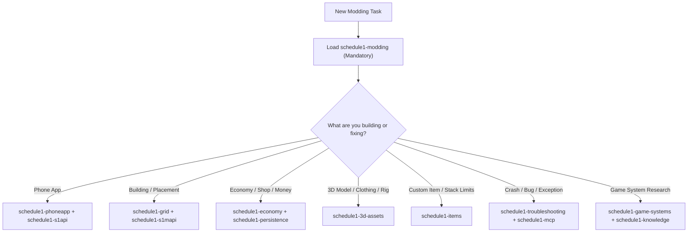

# AI-Agent Skills System (`.agents/skills/`)

This directory contains the **19 specialized AI-Agent Skills** designed for developing, maintaining, and debugging MelonLoader IL2CPP mods for *Schedule I* (v0.4.6f13). Regenerated from disk 2026-08-26 — reflects actual `references/` layout (not stale manual list).

---

## 🧭 How to Use Skills

> **Protocol for AI Agents:**
> 1. **Do not browse skills manually** unless researching. Load the relevant `SKILL.md` directly via `view_file` at the start of a task.
> 2. Always start with **`schedule1-modding`** as the foundational entry point for any mod task.
> 3. Read specific `references/*.md` sub-files on demand when dealing with deeper architectural sub-systems.
> 4. **Before using `Knowledge/` paths:** check `if (Test-Path Knowledge/)` — in this mod-only workspace `Knowledge/` is absent; fallback is `D:\Backup\game source` (v0.4.5f2 Alternate, ~1 version behind, 66k files). Verify any decompile hit against live `Assembly-CSharp.dll` via `ilspycmd` / S1MCP.

---

## 📚 Skill Inventory (14 Skills) — Disk-Verified

| Skill | Domain / Focus | Key Sub-References (actual on disk) | Primary Use Case |
|---|---|---|---|
| **`schedule1-modding`** | **Core Modding Runbook** | `architecture-and-shared.md`, `build-and-deploy.md`, `il2cpp-harmony-guide.md`, `mod-patterns.md`, `ui-and-s1api.md`, `version-sync.md` | **Primary skill (always first).** Scaffolding, MSBuild, deployment, coding standards. |
| **`schedule1-phoneapp`** | Smartphone Apps | `lifecycle-and-canvas.md`, `responsive-ui-theme.md`, `input-focus-and-controls.md`, `components-and-ugui.md` | In-game phone apps, uGUI layout scaling (`UITheme.Sp/Dp`), keyboard focus protection. |
| **`schedule1-grid`** | Grid & Building | `outdoor-placement.md`, `build-update-patching.md`, `collision-and-ghosts.md` | Unrestricted building, snapping, ghost placement, floor raycasts. |
| **`schedule1-s1api`** | S1API Framework | `lifecycle.md`, `saveables.md`, `phoneapp.md`, `quests.md`, `entities.md`, `items-products.md`, `money-economy.md`, `game-systems.md`, `cross-compat.md` | Using S1API 3.2.0 features, cross-version compatibility, lifecycle events. |
| **`schedule1-s1mapi`** | S1MAPI Framework | `procedural-mesh.md`, `materials.md`, `building.md`, `interior.md`, `gltf-loading.md`, `world-tools.md`, `recipes.md` | Runtime 3D world creation, procedural meshes, interior shells. |
| **`schedule1-game-systems`** | 64 Game Systems | `_index.md`, `01-FishNet-Networking.md` … `64-Weather.md` (66 files) + `README.md` | Looking up vanilla game mechanics without parsing raw decompiles. |
| **`schedule1-economy`** | Economy & Money | `atomic-purchase.md`, `passive-revenue.md`, `atm-double-entry.md` | Cash/Bank multi-payment, business income, customer budgets, laundering, supplier payments. |
| **`schedule1-persistence`** | Persistence Engine | `safestorage-atomic.md`, `slot-isolation.md`, `save-load-timing.md` | Save/load safety, `.bak` crash backups, `slot_{id}.json` isolation, migration. |
| **`schedule1-items`** | Item Framework | `registry-and-scan.md`, `stacklimit-engine.md`, `inventory-capacity.md` | Custom items, global stack limit overrides, equipment slot binding. |
| **`schedule1-3d-assets`** | 3D Assets & Blender | `blender-export.md`, `urp-rendering-materials.md`, `rigging-and-attachment.md` | Blender coordinate transforms (Y-Up), URP Lit shaders, bone parenting, zero-collider rule. |
| **`schedule1-interiors`** | Interiors & Minigames | `door-hooking.md`, `procedural-room.md`, `minigame-screens.md` | Entering buildings, procedural room instances, dynamic Texture2D screens. |
| **`schedule1-mcp`** | S1MCP Bridge | `live-debugging.md`, `tool-signatures.md` | Live game debugging over TCP :8765, object reflection, state inspection. |
| **`schedule1-knowledge`** | Research & Navigation | `inventory.md`, `search-recipes.md` | Efficiently querying decompiled source code and system analyses. |
| **`schedule1-troubleshooting`** | Diagnostics & Pitfalls | `common-errors.md`, `logscan-and-logs.md`, `save-load-timing.md` | Diagnosing crashes, memory leaks, `IntPtr` issues, IL2CPP collection traps. |
| **`schedule1-il2cpp-reflection`** | IL2CPP Runtime-Reflection | (none yet) | Array bridging, missing overloads, namespace fallback, private member access. **New 2026-08-26.** |
| **`schedule1-debounced-reload`** | Live-Reload Pattern | (none yet) | FileSystemWatcher debouncing, main-thread pump, retry-on-failure. **New 2026-08-26.** |
| **`schedule1-runtime-unity-cache`** | Unity-Object Lifecycle | (none yet) | Sprite/Texture/AudioClip cache with `Object.Destroy`, dirty flags, leak prevention. **New 2026-08-26.** |
| **`schedule1-harmony-bootstrap`** | Harmony Auto-Discovery | (none yet) | Walk-assembly patch application, per-class guards, applied/skipped/failed counters. **New 2026-08-26.** |

> **Counts verified 2026-08-25:** `schedule1-modding` 152L/6 refs, `phoneapp` 209L/4, `grid` 239→~95L/3 (split A), `s1api` 182L/9, `s1mapi` 139L/7, `game-systems` 111L/66, `economy` 100L/3, `persistence` 138L/3, `items` 109L/3, `3d-assets` 54L/3, `interiors` 136L/3, `mcp` 89L/2, `knowledge` 118L/2, `troubleshooting` 162L/3.

---

## 🗂️ Internal Skill Anatomy

Every skill is structured consistently:

```
.agents/skills/<skill-name>/
├── SKILL.md                 # Entry file: YAML frontmatter (name, description), decision tree, quick reference
└── references/              # Specialized deep-dive documentation
    ├── topic-a.md
    └── topic-b.md
```

Regeneration command (PowerShell 7):
```powershell
Get-ChildItem .agents/skills -Directory | % { "$($_.Name) : " + ((Get-ChildItem "$($_.FullName)/references" -File -ErrorAction SilentlyContinue | % Name) -join ", ") }
```

---

## 🎯 Decision Matrix: Which Skill to Load?



---

## 🛡️ Core Rules Enforced by Skills

1. **IntPtr Constructor:** Every `[RegisterTypeInIl2Cpp]` MonoBehaviour must have `public ComponentName(IntPtr ptr) : base(ptr) { }`.
2. **SafeStorage:** Never write raw `File.WriteAllText`. Always use `SafeStorage.SaveAtomic<T>()` with `.bak` recovery.
3. **Responsive UI:** Never use hardcoded pixel sizes. Always scale via `UITheme.Sp()` and `UITheme.Dp()`.
4. **PatchGuard:** Never apply raw Harmony patches that can break on game updates. Wrap in `PatchGuard.TryPatch()`.
5. **No foreach on Il2CppList:** Always iterate with indexed `for (int i = 0; i < count; i++)`.

---

## 📦 Knowledge Backup (D:\Backup\game source)

- **Location:** `D:\Backup\game source\` — `66611` files, `scripts/Assembly-CSharp` 87 subdirs, `bundleVersion 0.4.5f2 Alternate` (from `project-settings/ProjectSettings.asset:150`), ~1 version behind workspace `v0.4.6f13`.
- **Policy:** Skills that reference `Knowledge/` first check `if (Test-Path Knowledge/)` then fall back to this backup for **structure only**; drift is expected. Always verify patch targets / field names against live `Assembly-CSharp.dll` (via `ThirdParty/S1MCPServer-master/logscan.py` or `s1interop`) before shipping.
- **Export boundary:** `Tools/export-to-gemini-notebook/export-knowledge-base.ps1` intentionally excludes live `.cs` — Notebook gets only curated Skills/Mods/AGENTS, not raw decompiles.

