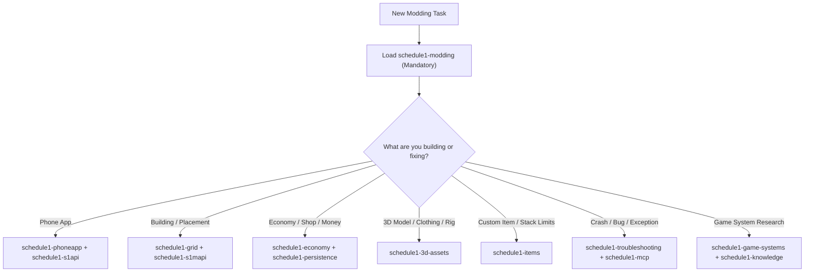

# AI-Agent Skills System (`.agents/skills/`)

This directory contains the **14 specialized AI-Agent Skills** designed for developing, maintaining, and debugging MelonLoader IL2CPP mods for *Schedule I* (v0.4.6f13).

---

## 🧭 How to Use Skills

> **Protocol for AI Agents:**
> 1. **Do not browse skills manually** unless researching. Load the relevant `SKILL.md` directly via `view_file` at the start of a task.
> 2. Always start with **`schedule1-modding`** as the foundational entry point for any mod task.
> 3. Read specific `references/*.md` sub-files on demand when dealing with deeper architectural sub-systems.

---

## 📚 Skill Inventory (14 Skills)

| Skill | Domain / Focus | Key Sub-References | Primary Use Case |
|---|---|---|---|
| **`schedule1-modding`** | **Core Modding Runbook** | `architecture-and-shared.md`, `build-and-deploy.md`, `quickstart-scaffold.md`, `s1api-cheat-sheet.md` | **Primary skill (always first).** Scaffolding, MSBuild, deployment, coding standards. |
| **`schedule1-phoneapp`** | Smartphone Apps | `method3-responsive-ui.md`, `input-focus-protection.md`, `lifecycle-stability.md` | In-game phone apps, uGUI layout scaling (`UITheme.Sp/Dp`), keyboard focus protection. |
| **`schedule1-grid`** | Grid & Building | `outdoor-placement.md`, `build-update-patching.md`, `collision-and-ghosts.md` | Unrestricted building, snapping, ghost placement, floor raycasts. |
| **`schedule1-s1api`** | S1API Framework | `saveables.md`, `phoneapps.md`, `quests.md`, `npcs.md`, `money.md`, `lifecycle.md` | Using S1API 3.2.0 features, cross-version compatibility, lifecycle events. |
| **`schedule1-s1mapi`** | S1MAPI Framework | `procedural-mesh.md`, `building-builder.md`, `gltf-loader.md`, `world-tools.md` | Runtime 3D world creation, procedural meshes, interior shells. |
| **`schedule1-game-systems`** | 64 Game Systems | `01-FishNet` to `64-Systems`, system decision trees, decompile mappings | Looking up vanilla game mechanics without parsing raw decompiles. |
| **`schedule1-economy`** | Economy & Money | `atomic-purchase.md`, `passive-revenue.md`, `atm-double-entry.md` | Cash/Bank multi-payment, business income, customer budgets, laundering. |
| **`schedule1-persistence`** | Persistence Engine | `safestorage-atomic.md`, `slot-isolation.md`, `gamelifecycle-timing.md` | Save/load safety, `.bak` crash backups, `slot_{id}.json` isolation, migration. |
| **`schedule1-items`** | Item Framework | `baseitem-definition.md`, `registry-patching.md`, `inventory-slots.md` | Custom items, global stack limit overrides, equipment slot binding. |
| **`schedule1-3d-assets`** | 3D Assets & Blender | `blender-export.md`, `urp-rendering-materials.md`, `rigging-and-attachment.md` | Blender coordinate transforms (Y-Up), URP Lit shaders, bone parenting, zero-collider rule. |
| **`schedule1-interiors`** | Interiors & Minigames | `door-hooking.md`, `room-shells.md`, `screen-rendering.md` | Entering buildings, procedural room instances, dynamic Texture2D screens. |
| **`schedule1-mcp`** | S1MCP Bridge | `live-introspection.md`, `log-capturing.md`, `remote-inspection.md` | Live game debugging over TCP :8765, object reflection, state inspection. |
| **`schedule1-knowledge`** | Research & Navigation | `inventory.md`, `search-recipes.md`, `decompile-map.md` | Efficiently querying decompiled source code and system analyses. |
| **`schedule1-troubleshooting`** | Diagnostics & Pitfalls | `il2cpp-pitfalls.md`, `crash-patterns.md`, `logscan.md` | Diagnosing crashes, memory leaks, `IntPtr` issues, IL2CPP collection traps. |

---

## 🗂️ Internal Skill Anatomy

Every skill is structured consistently:

```
.agents/skills/<skill-name>/
├── SKILL.md                 # Entry file: YAML frontmatter (name, description), decision tree, quick reference
└── references/              # Specialized deep-dive documentation
    ├── topic-a.md
    └── topic-b.md
```

---

## 🎯 Decision Matrix: Which Skill to Load?



---

## 🛡️ Core Rules Enforced by Skills

1. **IntPtr Constructor:** Every `[RegisterTypeInIl2Cpp]` MonoBehaviour must have `public ComponentName(IntPtr ptr) : base(ptr) { }`.
2. **SafeStorage:** Never write raw `File.WriteAllText`. Always use `SafeStorage.SaveAtomic<T>()` with `.bak` recovery.
3. **Responsive UI:** Never use hardcoded pixel sizes. Always scale via `UITheme.Sp()` and `UITheme.Dp()`.
4. **PatchGuard:** Never apply raw Harmony patches that can break on game updates. Wrap in `PatchGuard.TryPatch()`.
5. **No foreach on Il2CppList:** Always iterate with indexed `for (int i = 0; i < count; i++)`.
