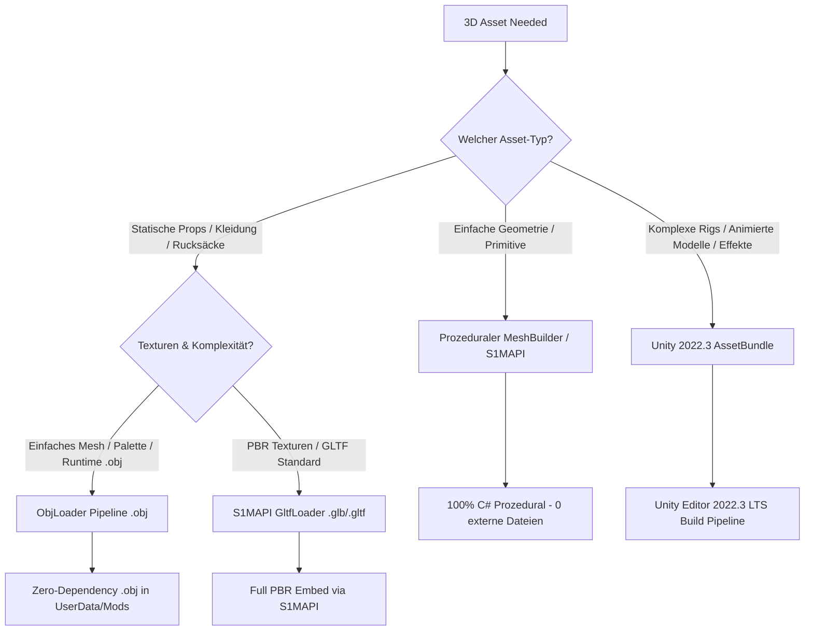

# Schedule I — 3D Asset & Blender Rendering Pipeline

This skill is the **complete runbook** for creating, exporting, and rendering 3D assets in *Schedule I* (v0.4.6f13, Unity 2022.3 LTS, Universal Render Pipeline).

---

## 1. Decision Tree: Which 3D Asset Pipeline to Use?

| Pipeline | Dateiformat | Loader / Tool | Wann nutzen? |
|---|---|---|---|
| **1. ObjLoader (Lightweight)** | `.obj` | `ObjLoader.cs` (in `Shared`/Mod) | Rucksäcke, Hüte, Waffen, Hand-Items, Schilder, Deko. Lädt direkt aus `UserData/<Mod>/models/`. |
| **2. S1MAPI GltfLoader** | `.glb` / `.gltf` | `S1MAPI.ProceduralMesh.GltfLoader` | Vollständige PBR-Modelle mit eingebetteten Texturen, Möbel, Fahrzeuge, Gebäude-Interieurs. |
| **3. Prozedurale Meshes** | C# Code | `ProceduralMeshBuilder` / `Mesh` | Schlafsäcke, Kisten, UI-Meshes, dynamische geometrische Formen ohne externe Dateien. |
| **4. Unity AssetBundle** | `.bundle` | `AssetBundle.LoadFromFile` | Animierte Charaktere, komplexe Skelett-Rigs, Partikeleffekte, Custom Shaders. |

---

## 2. Die 7 Goldenen Regeln für 3D-Assets in Schedule I

1. **Transformations-Reset in Blender (<kbd>Ctrl+A</kbd>):**  
   Immer vor dem Export in Blender <kbd>Ctrl+A</kbd> $\rightarrow$ **Apply All Transforms** (Rotation, Scale, Location) ausführen. Niemals unskalierte oder rotierte Objekte exportieren!
2. **Koordinaten-Standard ($Z$-Up vs. $Y$-Up):**  
   Blender nutzt $+Z$ als Oben, Unity nutzt $+Y$ als Oben. Export-Einstellung für OBJ/GLTF: **Forward: `-Z Forward` / Up: `Y Up`**.
3. **Face Orientation & Normalen-Check (<kbd>Shift+N</kbd>):**  
   Vor dem Export in Blender das Overlay **Face Orientation** einschalten. Blaue Flächen = Außenseite, rote Flächen = Innenseite. Bei roten Außenseiten alle Flächen markieren (<kbd>A</kbd>) und <kbd>Shift+N</kbd> drücken.
4. **URP-Shader-Kompatibilität (*Pink Shader Fix*):**  
   *Schedule I* läuft auf der **Universal Render Pipeline (URP)**. Standard Built-in Unity Shader werden grell pink. Immer `Shader.Find("Universal Render Pipeline/Lit")` oder `"Universal Render Pipeline/Unlit"` verwenden.
5. **Zero-Collider-Regel bei Kleidung & Wearables:**  
   Kleidungsstücke, Rucksäcke oder getragene Accessoires dürfen **keine aktiven Collider** besitzen (`Destroy(collider)` beim Laden), da sie sonst Raycasts abfangen, das Inventar-Klicken blockieren oder Physik-Glitches verursachen.
6. **Avatar-Proportionen einhalten:**  
   Die Spielfigur in *Schedule I* ist schlank und stilisiert. Torsobreite: $\approx 0{,}12\text{--}0{,}14\,\text{m}$, Gesamthöhe: $\approx 1{,}75\,\text{m}$. Niemals mit Standard-1m-Würfeln als Rucksack arbeiten, sondern an den realen Avatar-Maßen ausrichten.
7. **Material-Speicher-Hygiene (`sharedMaterial` vs `material`):**  
   Im Code niemals unbedacht `renderer.material` abfragen (erzeugt Memory-Leaks durch dynamische Instanzen), sondern `renderer.sharedMaterial` nutzen oder Materialien in `static readonly` Feldern cachen.

---

## 3. Modul-Übersicht & Referenz-Guides

* **[Blender Export & Geometrie-Vorbereitung](references/blender-export.md):**  
  Achsen-Konvertierung, Maßstäbe, Normalen-Fixes, UV-Mapping, Mesh-Optimierung.
* **[URP Rendering & Material Pipeline](references/urp-rendering-materials.md):**  
  Universal Render Pipeline Shader, PBR-Eigenschaften (Metallic, Smoothness, Normal Maps), Texture-Streaming und Pink-Shader-Vermeidung.
* **[Rigging & Bone-Attachment](references/rigging-and-attachment.md):**  
  Anheften von 3D-Meshes an Avatar-Knochen (`Spine2`, `Head`, `Hands`), Zero-Collider-Sicherheit und 360°-Mannequin-Inspektion.
