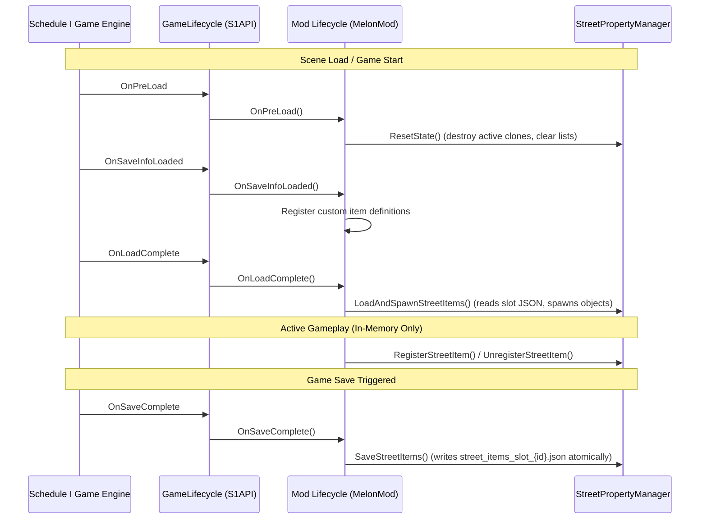

# Schedule I - Grid & Building System Skill

This skill documents how to work with the building, placement, and grid systems in *Schedule I* (IL2CPP / MelonLoader), particularly when creating outdoor/unrestricted placement systems (such as `HomelessMod`) or extending vanilla building mechanics.

---

## Reference Architecture & Key Classes

| Class / Component | Type | Responsibility & Behavior |
|---|---|---|
| `BuildUpdate_Grid` | Vanilla (`Il2CppScheduleOne.Building`) | Manages build mode ghost positioning, rotation, raycasting, and placement execution. |
| `GridItem` | Vanilla (`Il2CppScheduleOne.EntityFramework`) | Attached to vanilla buildables. Triggers auto-deletion if placed outside a purchased property grid. |
| `BuildableItem` | Vanilla (`Il2CppScheduleOne.EntityFramework`) | Manages property attachment, network registration, and culling states. |
| `GridManager` | Vanilla (`Il2CppScheduleOne.Tiles`) | Tracks valid purchased properties via invisible "Grid" layer trigger colliders. |
| `BuildManager` | Vanilla (`Il2CppScheduleOne.Building`) | Singleton (`NetworkSingleton<BuildManager>.Instance`) providing ghost materials, sound effects, and networking/navigation strippers (`DisableNetworking`, `DisableNavigation`). |
| `FootprintTile` / `TileAppearance` | Vanilla (`Il2CppScheduleOne.Tiles`) | Visual indicator tiles instantiated below grid objects. Must be suppressed for outdoor placement. |
| `Property` | Vanilla (`Il2CppScheduleOne.Property`) | Core property entity. **Never attach directly to virtual world roots.** |
| `GroundPlacementAssistant` | Custom Helper (`HomelessMod.Building`) | Zero-allocation helper for smart 5-point ground sampling, slope checks (≤ 45°), box collision non-alloc checks, and dual-grid snapping. |
| `StreetPropertyManager` | Custom Manager (`HomelessMod.Building`) | Virtual world root container (`StreetNomad_WorldRoot`), in-memory registration, save-slot isolated persistence, and GUID deduplication. |
| `OutdoorItemInteractable` | Custom Component (`HomelessMod.Building`) | IL2CPP-registered MonoBehaviour for holding RMB or pressing [F] to dismantle/pack up placed world objects. |

---

## The 7 Golden Rules of Outdoor / Unrestricted Building

When modding Schedule I to allow building outside vanilla purchased properties, strict rules must be followed to avoid crashes, object self-destruction, invisible items, duplicated items, and UI pollution:

### 1. NEVER Use `DestroyImmediate` on `GridItem`
- **The Problem:** Calling `GameObject.DestroyImmediate(gridItem)` or `Destroy(gridItem)` on instantiated clones leaves dangling/null native C++ pointers, corrupts internal component arrays, and throws native NREs when vanilla scripts attempt to query the component.
- **The Rule:** Keep the component instance intact, but **disable it immediately**:
  ```csharp
  var gridItems = placedObj.GetComponentsInChildren<GridItem>(true);
  foreach (var gi in gridItems)
  {
      if (gi != null && gi.Pointer != IntPtr.Zero)
      {
          try { gi.SetFootprintTileVisiblity(false); } catch { }
          gi.enabled = false;
      }
  }
  ```
- **Harmony Patch:** Prefix `GridItem.Destroy` to return `false` if `StreetPropertyManager.IsOutdoorItem(__instance.gameObject)` to block vanilla auto-destruction checks.

### 2. Strip FishNet Networking on Local Clones
- **The Problem:** Vanilla buildable prefabs contain FishNet `NetworkIdentity` and navigation components that expect server authority and a parent `Property`. Outdoor clones instantiated locally will throw networking errors, desync, or cause phantom RPC calls.
- **The Rule:** Strip FishNet networking and navigation components immediately after instantiation:
  ```csharp
  var buildMgr = NetworkSingleton<BuildManager>.Instance;
  if (buildMgr != null && buildMgr.Pointer != IntPtr.Zero)
  {
      buildMgr.DisableNetworking(placedObj);
      buildMgr.DisableNavigation(placedObj);
  }
  ```

### 3. Harmony Guards on `BuildableItem.Start` & `SetCulled`
- **The Problem:**
  - `BuildableItem.Start()` looks up its parent `Property`. When placed in the open world, its parent is a virtual root (e.g. `StreetNomad_WorldRoot`), causing `Start()` to throw an exception or destroy the object.
  - `BuildableItem.SetCulled(bool culled)` is used by vanilla rooms/interiors to hide items when the player exits a building. For street objects, room culling logic will turn outdoor renderers completely invisible!
- **The Rule:** Apply Harmony prefix guards on `BuildableItem.Start` and `BuildableItem.SetCulled`:
  ```csharp
  [HarmonyPatch(typeof(BuildableItem), "Start")]
  public static class BuildableItem_Start_Patch
  {
      public static bool Prefix(BuildableItem __instance)
      {
          if (__instance != null && __instance.Pointer != IntPtr.Zero && __instance.gameObject != null)
          {
              if (StreetPropertyManager.IsOutdoorItem(__instance.gameObject))
                  return false; // Skip property lookup / auto-destruction
          }
          return true;
      }
  }

  [HarmonyPatch(typeof(BuildableItem), nameof(BuildableItem.SetCulled))]
  public static class BuildableItem_SetCulled_Patch
  {
      public static bool Prefix(BuildableItem __instance, bool culled)
      {
          if (__instance != null && __instance.Pointer != IntPtr.Zero && __instance.gameObject != null)
          {
              if (StreetPropertyManager.IsOutdoorItem(__instance.gameObject))
                  return false; // Prevent outdoor street items from ever being culled
          }
          return true;
      }
  }
  ```
  Also disable `b.enabled = false` on all child `BuildableItem` instances upon placement.

### 4. Never Attach a Real `Property` Component to `_streetRoot`
- **The Problem:** If `StreetNomad_WorldRoot` has a vanilla `Property` component attached, game systems (such as phone real estate apps, business dashboards, police raid managers, and NPC pathing) will discover `StreetNomad_WorldRoot` as a purchased property. This corrupts business listings, causes NREs in property calculations, and breaks phone UI menus.
- **The Rule:** Keep `StreetNomad_WorldRoot` as a pure, clean `GameObject` protected by `GameObject.DontDestroyOnLoad(_streetRoot)`. Never attach a `Property` component. Manage outdoor objects through custom singleton managers (`StreetPropertyManager`).

### 5. Footprint & Grid Tile Suppression
- **The Problem:** Vanilla buildable prefabs instantiate with green/red footprint indicator tiles (`FootprintTile`, `TileAppearance`), creating ugly floating tiles on roads and sidewalks.
- **The Rule:** Suppress footprint tiles in three steps:
  1. Deactivate all `FootprintTile` child GameObjects: `ft.gameObject.SetActive(false)`.
  2. Call `gi.SetFootprintTileVisiblity(false)` on all `GridItem` components.
  3. Filter child `Renderer` components so footprint and tile renderers are disabled while object mesh renderers remain enabled:
  ```csharp
  var renderers = placedObj.GetComponentsInChildren<Renderer>(true);
  foreach (var r in renderers)
  {
      if (r != null && r.Pointer != IntPtr.Zero)
      {
          if (r.GetComponentInParent<FootprintTile>() != null ||
              r.GetComponentInParent<TileAppearance>() != null)
          {
              r.enabled = false;
              continue;
          }
          r.enabled = true;
      }
  }
  ```

### 6. Save Synchronicity (Anti-Duplication / Anti-Dupe Rule)
- **The Problem:** Saving to disk immediately on placement or pack-up breaks savegame transactional integrity. If a player drops an item and it is immediately serialized to disk, but the player then quits without saving (Alt+F4 or exit without save), the game reverts player inventory to the previous save while the mod's file retains the placed item — resulting in an infinite item duplication exploit.
- **The Rule:**
  - Keep runtime placement, dismantling, and pack-up **strictly in-memory** during gameplay (`_activeStreetObjects`, `_objectRecords`, `_knownGuids`).
  - Serialize to disk **only** during `GameLifecycle.OnSaveComplete`.
  - Isolate save files per save slot: `street_items_slot_{slotId}.json` resolved via `LoadManager.Instance.ActiveSaveInfo.SaveSlotNumber`.
  - Clear in-memory state on `GameLifecycle.OnPreLoad` and scene unload (`OnSceneWasUnloaded`).

### 7. IL2CPP-Safe Hierarchy & Pointer Validation
- **The Problem:** In Unity IL2CPP, native C++ objects may be destroyed while their C# managed wrappers remain alive in memory (`Pointer == IntPtr.Zero`). Calling `GetComponentInParent<T>()` or checking `obj == null` without pointer checks will throw native null pointer exceptions or swallow errors in empty catch blocks.
- **The Rule:**
  - Always check `if (obj == null || obj.Pointer == IntPtr.Zero)` before accessing properties.
  - Use iterative `transform.parent` walking instead of fragile `GetComponentInParent<T>()`:
  ```csharp
  public static bool IsOutdoorItem(GameObject? go)
  {
      if (go == null || go.Pointer == IntPtr.Zero) return false;
      try
      {
          if (IsRegisteredStreetObject(go)) return true;

          Transform? curr = go.transform;
          while (curr != null && curr.Pointer != IntPtr.Zero)
          {
              if (HasStreetRoot && curr.gameObject == _streetRoot)
                  return true;

              if (curr.GetComponent<OutdoorItemInteractable>() != null ||
                  curr.GetComponent<SleepingBagInteractable>() != null)
              {
                  return true;
              }

              curr = curr.parent;
          }
      }
      catch { }
      return false;
  }
  ```

---

## Placement & Load Lifecycle Order

### A. Real-Time Ghost Evaluation (`BuildUpdate_Grid.CheckIntersections` Postfix)
Runs every frame while build mode is active:
1. **Sanity Guards:** Check config (`EnableEverywhereBuilding`), `__instance.Pointer != IntPtr.Zero`, `GhostModel`, and `BuildManager`.
2. **Vanilla Pass-Through:** If vanilla already found a valid position on a purchased property (`__instance._validPosition == true`), apply `ghostMaterial_White` and return.
3. **Camera Resolution:** Resolve `PlayerSingleton<PlayerCamera>.Instance.Camera.transform` with fallback to `Camera.main.transform`.
4. **Raycasting:**
   - Cast ray along camera forward with mask `~LayerMask.GetMask("Ignore Raycast", "Player")` and `QueryTriggerInteraction.Ignore`.
   - **CRITICAL:** Do NOT exclude the `Grid` layer from the raycast mask; some street/terrain meshes reside on the `Grid` layer.
   - If forward raycast fails, perform a fallback raycast straight down from a point 2m in front of the camera (`fallbackStart.y += 1.5f`).
5. **Ground Sampling & Slope Check (`GroundPlacementAssistant`):**
   - Sample 4 corner ground elevations around the object's footprint to prevent sinking on curbs and slopes.
   - Validate ground slope angle (≤ 45°) and reach distance (0.3m–7.0m from camera).
   - Check space clearance using `Physics.OverlapBoxNonAlloc` (shrink extents to 85%, raise center above ground, ignore player and ghost model colliders).
6. **Ghost Feedback:** Position and rotate ghost model. If valid, set `IsCustomPlacementValid = true`, `__instance._validPosition = true`, and apply `ghostMaterial_White`. Otherwise, set `_validPosition = false` and apply `ghostMaterial_Red`.

### B. Placement Execution (`BuildUpdate_Grid.Place` Prefix)
Triggers when the player left-clicks:
1. If `!IsCustomPlacementValid`, return `true` (let vanilla handle or reject).
2. Retrieve `itemInstance.Definition` and `bDef.BuiltItem`.
3. If source prefab is active, temporarily deactivate it before instantiating:
   ```csharp
   bool wasActive = bDef.BuiltItem.gameObject.activeSelf;
   if (wasActive) bDef.BuiltItem.gameObject.SetActive(false);
   var placedObj = GameObject.Instantiate(bDef.BuiltItem.gameObject, spawnPos, spawnRot);
   if (wasActive) bDef.BuiltItem.gameObject.SetActive(true);
   ```
4. Set parent to `StreetPropertyManager.StreetRoot.transform`.
5. Call `BuildManager.Instance.DisableNetworking(placedObj)` and `DisableNavigation(placedObj)`.
6. Attach `OutdoorItemInteractable` (set `ItemId = itemId`).
7. Deactivate `FootprintTile` components, call `gi.SetFootprintTileVisiblity(false)`, disable `gi.enabled = false` and `b.enabled = false`.
8. Filter child renderers (disable footprint/tile appearance renderers, enable item mesh renderers).
9. Enable colliders (`c.enabled = true`) and ensure rigidbodies are kinematic (`rb.isKinematic = true`).
10. Activate placed object: `placedObj.SetActive(true)`.
11. Register in manager: `StreetPropertyManager.RegisterStreetItem(placedObj, itemId, itemGuid)`.
12. Deduct item from inventory: `PlayerInventory.Instance.RemoveAmountOfItem(itemId, 1u)`.
13. Play sound: `BuildManager.Instance.PlayBuildSound(bDef.BuildSoundType, spawnPos)`.
14. Notify quests: `HomelessQuestManager.NotifyItemPlaced(itemId)`.
15. Terminate build mode cleanly: `__instance.Stop()`, set `__result = null`, reset `IsCustomPlacementValid = false`, and return `false` (skip crashing native `Place()`).

### C. Save & Load Lifecycle Timing
Mod saves must align precisely with `S1API.Lifecycle.GameLifecycle`:


---

## Pack-Up & Dismantling Pattern (`OutdoorItemInteractable`)

Generic outdoor items (pots, workstations, drying racks, tables, sleeping bags) support in-game dismantling:
1. **Interaction Detection:** In `Update()`, check distance (≤ 3.0m) and camera forward dot product / raycast against item colliders.
2. **Inputs:**
   - **[F] Key:** Instant pack-up.
   - **Hold RMB (Right Mouse Button):** Progress bar fills over 0.40s.
3. **HUD Feedback:** Render a compact, non-allocating IMGUI box using cached `GUIStyle` and dynamic height scaling (`Mathf.Clamp(Screen.height / 900f, 0.80f, 1.25f)`).
4. **Execution (`PackUp`):**
   - Return item to inventory: `PlayerInventory.Instance.AddItemToInventory(...)` (with `ConsoleHelper.AddItemToInventory` fallback).
   - Unregister from manager: `StreetPropertyManager.UnregisterStreetItem(gameObject)`.
   - Destroy game object: `GameObject.Destroy(gameObject)`.
   - **Note:** In-memory unregistration only; disk persistence is handled at `OnSaveComplete`.

---

## Complete Verification Checklist for Grid Mods

- [ ] **Raycast Layers:** Does `Physics.Raycast` mask allow hitting the `Grid` layer with `QueryTriggerInteraction.Ignore`?
- [ ] **GridItem Safety:** Are `GridItem` components disabled (`gi.enabled = false`) rather than destroyed with `DestroyImmediate`?
- [ ] **Networking Stripped:** Are `DisableNetworking` and `DisableNavigation` called on newly instantiated clones?
- [ ] **Harmony Guards:** Are `BuildableItem.Start` and `BuildableItem.SetCulled` patched to prevent outdoor destruction and culling?
- [ ] **Clean Virtual Root:** Is `StreetNomad_WorldRoot` a clean `GameObject` without any `Property` component?
- [ ] **Footprint Suppression:** Are `FootprintTile` objects deactivated and footprint renderers disabled?
- [ ] **Physics Stability:** Are child `Rigidbody` components set to `isKinematic = true` to prevent falling through terrain?
- [ ] **Anti-Duplication:** Are runtime place/pack-up operations in-memory only, saving to disk strictly on `GameLifecycle.OnSaveComplete`?
- [ ] **Slot Isolation:** Is save file naming slot-specific (`street_items_slot_{slotId}.json`) with legacy migration fallback?
- [ ] **IL2CPP Null Safety:** Are all game objects, transforms, colliders, and singletons checked for `Pointer != IntPtr.Zero`?
- [ ] **Hierarchy Resolution:** Does `IsOutdoorItem` use iterative `transform.parent` walking rather than `GetComponentInParent<T>`?
- [ ] **Build State Reset:** Is `IsCustomPlacementValid` properly reset to `false` in `Place()`, `Stop()`, and exception handlers?

