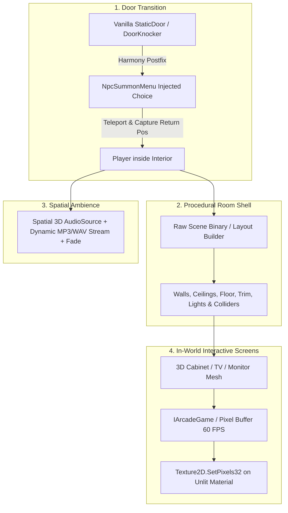

# Schedule I — Interiors & Minigame Systems Skill

This skill documents **how to inject custom enterable buildings, procedural 3D rooms, seamless vanilla door transitions, and interactive in-world screens/minigames** into *Schedule I* (v0.4.6f13, IL2CPP), derived and verified from `ScheduleIArcade` and `HomelessMod`.

---

## 1. Architecture Overview (The 4 Pillars)



---

## 2. Pillar 1: Seamless Door Hooking & Transitions

To make custom buildings accessible without editing vanilla map scenes, hook existing building doors or placed entrance markers.

### Core Lifecycle:
1. **Patch `StaticDoor` and `DoorKnocker`:**
   ```csharp
   [HarmonyPatch(typeof(StaticDoor), nameof(StaticDoor.Interacted))]
   public static class StaticDoorPatch
   {
       [HarmonyPostfix]
       public static void Postfix(StaticDoor __instance)
       {
           ArcadeEntranceService.Instance.NotifyVanillaStaticDoorInteracted(__instance);
       }
   }
   ```
2. **Inject Choice into `NpcSummonMenu`:**
   * When the door UI opens, instantiate a clone of a native button (`TryInjectNativeEnterChoice`).
   * Set text (e.g. `[ Enter Arcade ]`) and hook `Button.onClick`.
   * Suppress conflicting vanilla door summons while entering (`_suppressDoorUntil = Time.time + 1.5f`).
3. **Player Teleportation & State Safety:**
   * Capture return position: `_outsideReturnPosition = player.transform.position;`
   * Safely disable `CharacterController`, set target room position, and re-enable:
     ```csharp
     var cc = player.GetComponent<CharacterController>();
     if (cc != null) cc.enabled = false;
     player.transform.position = roomTargetPosition;
     if (cc != null) cc.enabled = true;
     ```
   * Unlock cursor and restore gameplay input (`RestoreGameplayInput()`).

---

## 3. Pillar 2: Procedural 3D Room Shells (No AssetBundles Required)

Instead of compiling large `.unity` scene bundles, build room geometry dynamically via C# and binary mesh caching:

1. **Binary Mesh Streaming (`runtime_meshes.bin`):**
   * Header: Magic byte check + mesh count.
   * Per Mesh: Vertex array `(x, y, z)`, Normals, UV coordinates, Triangles, Submeshes.
   * Instant runtime instantiation via `new Mesh() { vertices = ..., triangles = ... }`.
2. **Procedural Architecture Infill:**
   * **Collision Shell (`CreateEnvironmentCollisionShell`):** Generate box colliders on exterior walls and floor to prevent players from clipping out of bounds.
   * **Ceiling & Checkerboard Floors:** Create tiled textured quads with repeating UV scale (`mainTextureScale = new Vector2(tilesX, tilesZ)`).
   * **Perimeter Trim & Bands:** Accent moldings along wall-floor and wall-ceiling junctions.
   * **Interior Lighting:** Spawn `Light` components (`LightType.Point`, range 10–18m, warm/neon colors, shadow casting).

---

## 4. Pillar 3: Dynamic 3D In-World Screens (`Texture2D` Canvas)

Render playable minigames, video feeds, or dynamic security monitors directly onto 3D props in the game world:

```csharp
public interface IArcadeGame
{
    string Id { get; }
    string DisplayName { get; }
    Texture ScreenTexture { get; }
    void Initialize();
    void Start();
    void Tick(float deltaTime);
    void Stop();
}
```

### High-Performance Rendering Loop (60 FPS):
1. Allocate an in-memory pixel buffer: `Color32[] _pixels = new Color32[width * height];`
2. Run pure C# game logic in `Tick(deltaTime)` (PacMan AI, Pinball physics, Snake/Pong).
3. Draw primitives directly to `_pixels`:
   ```csharp
   public void SetPixel(int x, int y, Color32 color) => _pixels[y * width + x] = color;
   ```
4. Upload to GPU texture:
   ```csharp
   _texture.SetPixels32(_pixels);
   _texture.Apply(false); // false = skip mipmap generation for max performance
   ```
5. Apply material: Use `Shader.Find("Universal Render Pipeline/Unlit")` or `Simple Lit` on the cabinet screen mesh so it glows vividly in dark rooms.

---

## 5. Pillar 4: Cabinet Focus Mode & Input Routing

To allow first-person interaction with in-world terminals or game cabinets:

1. **Aim Raycast (`CabinetInteractionService`):**
   * Cast a ray from `Camera.main.transform.position` forward (max distance 2.5m).
   * If hitting an `ArcadeCabinet` collider, show prompt: `[E] Play Space Cadet Pinball`.
2. **Focus Mode Transition:**
   * On keypress <kbd>E</kbd>, save player camera orientation.
   * Smoothly lock player movement (`PlayerMovement.CanMove = false`).
   * Route keyboard inputs (Arrow keys, Spacebar, WASD) directly to active `IArcadeGame`.
3. **Exit Loop:**
   * Pressing <kbd>Escape</kbd> or <kbd>E</kbd> stops the minigame, restores `PlayerMovement.CanMove = true`, and returns camera control.

---

## 6. Pillar 5: Spatial 3D Audio & Streaming Ambience

1. Attach an `AudioSource` to the room center root:
   ```csharp
   var audio = roomRoot.AddComponent<AudioSource>();
   audio.spatialBlend = 1.0f; // 100% 3D spatial sound
   audio.rolloffMode = AudioRolloffMode.Linear;
   audio.minDistance = 3f;
   audio.maxDistance = 25f;
   audio.loop = true;
   ```
2. Stream audio file from disk:
   ```csharp
   using var uwr = UnityWebRequestMultimedia.GetAudioClip("file://" + mp3Path, AudioType.MPEG);
   yield return uwr.SendWebRequest();
   audio.clip = DownloadHandlerAudioClip.GetContent(uwr);
   audio.Play();
   ```
3. Fade volume smoothly over 1.5s upon room entry and exit.

---

## 7. Common Gotchas & Guardrails

1. **CharacterController Teleport Glitch:** Never set `transform.position` while `CharacterController.enabled == true`; Unity's physics engine will snap the player back to the exterior. Always toggle `enabled = false` $\rightarrow$ set pos $\rightarrow$ `enabled = true`.
2. **Return Position Zero Trap:** If the player loads directly inside the room or restarts, `_outsideReturnPosition` might be null $\rightarrow$ always provide a fallback exterior coordinate (e.g. sidewalk outside the building).
3. **Texture Mipmap Performance Penalty:** Always pass `_texture.Apply(false)` when uploading 60 FPS pixel buffers to avoid regenerating mipmaps every frame.
4. **Input Leak to Character:** When playing an arcade game or using a terminal, always hook and disable `PlayerMovement.Instance.CanMove` so the character doesn't walk into walls while pressing arrow keys.
