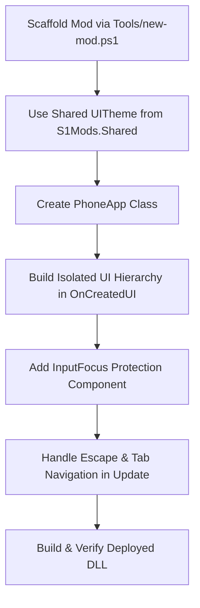

# Schedule I — PhoneApp Development Runbook (S1API & IL2CPP)

This skill is the authoritative engineering standard for building, styling, and maintaining in-game smartphone applications (`S1API.PhoneApp.PhoneApp`) in *Schedule I*.

---

## 0. Quick Navigation & References

| Reference Guide | Content |
|---|---|
| [`references/lifecycle-and-canvas.md`](references/lifecycle-and-canvas.md) | S1API discovery, container hierarchy, `Orientation`, `IsOpen()` sync, and avoiding the "Transparent Phone" destruction bug. |
| [`references/responsive-ui-theme.md`](references/responsive-ui-theme.md) | Method 3: Responsive canvas scaling (`UITheme.Sp` for fonts, `UITheme.Dp` for pixels), DPI clamping curves. |
| [`references/input-focus-and-controls.md`](references/input-focus-and-controls.md) | WASD input protection (`MyAppInputFocus`), IL2CPP `IntPtr` constructor, desktop navigation (<kbd>Escape</kbd>, <kbd>Tab</kbd>, <kbd>Ctrl+S</kbd>). |
| [`references/components-and-ugui.md`](references/components-and-ugui.md) | `UIFactory` widgets, safe IL2CPP button listeners, 0-allocation list scrolling, modal backdrops. |

---

## 1. The 9 Golden Rules of PhoneApp Modding

1. **Explicit Orientation:** Always override `protected override EOrientation Orientation => EOrientation.Vertical;` (or `Horizontal` for wide tablet dashboards). Never leave it unassigned.
2. **Never Destroy GameObjects on Close:** Never call `Object.Destroy()` or clear UI hierarchies in `OnPhoneClosed()`. Only hide modals or reset navigation. Destroying UI objects on close causes the **"Transparent Phone" (empty housing)** bug when the phone is raised again.
3. **Isolated Background Panel (`_mainBG`):** Build your UI inside a dedicated root panel parented to `container.transform` with `fullAnchor: true`, and start with `_mainBG.SetActive(false)`.
4. **Use Method 3 (`S1Mods.Shared.UITheme`):** Calculate all fonts with `UITheme.Sp(...)` and dimensions with `UITheme.Dp(...)`. The game's phone canvas is high-resolution and rotated by 90°. Single source of truth: `S1Mods.Shared.UITheme` (Shared/UITheme.cs) — never duplicate the math in a local class.
5. **Protect Input Focus:** Every text `InputField` must be guarded by an `[RegisterTypeInIl2Cpp]` `MonoBehaviour` with a public `IntPtr` constructor that toggles `S1API.Input.Controls.IsTyping` to prevent WASD player movement while typing.
6. **Safe Button Wiring:** Never call `button.onClick.AddListener(...)` directly in IL2CPP. Always use `ButtonUtils.AddListener(btn, ...)` or `EventHelper.AddListener(...)`.
7. **Atomic Persistence:** Save app state via `S1Mods.Shared.SafeStorage.SaveAtomic(...)` with `.bak` backups to prevent save file corruption during sudden crashes.
8. **Audio Feedback:** Play native game audio like `MoneyManager.Instance.PlayCashSound()` for successful transactions and procedural buzzers for errors to enhance UX (see `PocketShop` and `BankApp`).
9. **Multi-Payment Safety:** When implementing shops or banks, carefully check both physical cash (`cashBalance`) and online bank accounts (`onlineBalance`), considering inventory slot capacity limits (see `BankApp`).

### Rule 11 (empirical, 2026-08-21): Slot-Isolated Persistence for PhoneApps

**Symptom:** `CalculatorApp` `calculator_state.json` was global → Slot-A history leaked into Slot-B, Save leaked across saves. `Latest.log` clean, but `UserData/CalculatorApp/calculator_state.json` never used `slot_{n}`.

**Root cause:** `CalculatorState.GetStateFilePath()` returned `SafeStorage.GetUserDataPath("CalculatorApp","calculator_state.json")` without `LoadManager.Instance.ActiveSaveInfo.SaveSlotNumber`. All slot-aware mods (`NotesApp` `notes_slot_{n}.json:252`, `BankApp` `bank_slot_{n}.json`, `HomelessMod` `street_items_slot_{n}.json`, `BusinessIncome` `payout_state_slot_{n}.json`) use the suffix + `TryMigrateLegacy` (move legacy global once if slot file missing).

**Fix pattern (`CalculatorState.cs:65-93`):**
```csharp
private static string _lastKnownSlot = "default";
public static string GetActiveSlotSuffix() {
    try { var info = LoadManager.Instance?.ActiveSaveInfo; if (info!=null){_lastKnownSlot=info.SaveSlotNumber.ToString();return _lastKnownSlot;}} catch{}
    return _lastKnownSlot;
}
public static string GetStateFilePath() {
    string s = GetActiveSlotSuffix();
    string path = SafeStorage.GetUserDataPath("CalculatorApp",$"calculator_state_slot_{s}.json");
    TryMigrateLegacy(path); return path;
}
private static void TryMigrateLegacy(string slotPath){
    string legacy = SafeStorage.GetUserDataPath("CalculatorApp","calculator_state.json");
    if (!File.Exists(legacy)) return; if (File.Exists(slotPath)){File.Delete(legacy);return;} File.Move(legacy,slotPath);
}
```
`Load()`/`Save()` must use `GetStateFilePath()` — **every** PhoneApp with non-slot file is buggy.

### Rule 10 (empirical, 2026-08-20): Never Unsubscribe `MelonEvents.OnUpdate` in `OnPhoneClosed()`

**Symptom:** All 5 phone apps (NotesApp, CalculatorApp, PotScanner, PocketShop, BankApp) showed a **blank app after the 1st phone close** — regression introduced by adding `MelonEvents.OnUpdate.Unsubscribe(Update)` to `OnPhoneClosed`.

**Root cause:** S1API auto-discovery (`HomeScreen_Start_Patch`) instantiates your `PhoneApp` class **exactly once** per scene. `OnCreated()` fires only at that instantiation. `OnPhoneClosed()` fires on *every* close. Unsubscribing the Update loop in `OnPhoneClosed` means it is never re-subscribed → `_mainBG.SetActive(open)` sync in `Update()` never runs again → app stays hidden forever (until scene reload).

**The fix pattern (idempotent, self-healing):**
```csharp
protected override void OnCreated()
{
    base.OnCreated();
    // Defensive Unsubscribe-before-Subscribe ONLY here (idempotency on re-creation).
    MelonEvents.OnUpdate.Unsubscribe(Update);
    MelonEvents.OnUpdate.Subscribe(Update);
}

protected override void OnPhoneClosed()
{
    base.OnPhoneClosed();
    if (_mainBG != null) _mainBG.SetActive(false);
    // NEVER unsubscribe MelonEvents.OnUpdate here — OnCreated fires only once per scene!
    // Also never -= static event handlers (Money.OnBalanceChanged, OnPotsScanned, ...)
    // here unless the class instance itself is destroyed.
}
```

**Corollary:** The same applies to **static event handlers** (`PotTracker.OnPotsScanned`, `Money.OnBalanceChanged`, `TransactionHistoryService.OnHistoryChanged`, `_engine.OnStateChanged`). Unsubscribing them in `OnPhoneClosed` kills live-updates after the first close. The defensive `-=` before `+=` in `OnCreated` is sufficient and correct.

---

## 2. Step-by-Step Runbook: Creating a New PhoneApp



### Step 1: Scaffold the Project
```pwsh
pwsh Tools\new-mod.ps1 -Name <MyAppName>
```

### Step 2: Use Shared `UITheme` (Method 3)
Reference `S1Mods.Shared.UITheme` directly (canonical since 2026-08-20 — do NOT create a local UITheme class):
```csharp
using S1Mods.Shared;

// In OnCreatedUI:
S1Mods.Shared.UITheme.InitializeForTextApp(containerRt);    // 750f, 0.85–2.0 (text-heavy)
// or: S1Mods.Shared.UITheme.InitializeForDashboard(containerRt);  // 900f, 0.75–1.20 (dense lists)

int sp = S1Mods.Shared.UITheme.Sp(14);     // fonts
float dp = S1Mods.Shared.UITheme.Dp(36f);  // dimensions/padding
```

*(Optional mod-specific wrapper `UI/UITheme.cs` only if you need a custom palette — it must delegate to `S1Mods.Shared.UITheme` for `Sp/Dp/Scale`, never reimplement the math.)*

### Step 3: Implement the Production-Ready PhoneApp Class
In `<MyAppName>/src/MyAppApp.cs`:
```csharp
using System;
using System.IO;
using MelonLoader;
using MyAppName.UI;
using S1API.PhoneApp;
using S1API.UI;
using S1Mods.Shared;
using UnityEngine;
using UnityEngine.UI;

namespace MyAppName;

public sealed class MyAppApp : PhoneApp
{
    protected override string AppName => "MyApp";
    protected override string AppTitle => "My App";
    protected override string IconLabel => "My App";
    protected override string IconFileName => string.Empty; // Using custom IconSprite
    protected override EOrientation Orientation => EOrientation.Vertical;

    private GameObject _mainBG = null!;
    private Text _titleLabel = null!;

    protected override void OnCreated()
    {
        base.OnCreated();
        // Idempotent: defensive Unsubscribe-before-Subscribe (OnCreated fires ONCE per scene).
        MelonEvents.OnUpdate.Unsubscribe(Update);
        MelonEvents.OnUpdate.Subscribe(Update);
        MelonLogger.Msg($"[{AppName}] Registered with S1API PhoneApp system.");
    }

    protected override void OnCreatedUI(GameObject container)
    {
        var containerRt = container.GetComponent<RectTransform>();
        if (containerRt != null)
        {
            S1Mods.Shared.UITheme.InitializeForTextApp(containerRt);
        }

        // 1. Isolated Background Panel
        _mainBG = UIFactory.Panel("MyApp_MainBG", container.transform, new Color(0.07f, 0.08f, 0.11f, 1f), fullAnchor: true);
        _mainBG.SetActive(false);

        var vlg = _mainBG.AddComponent<VerticalLayoutGroup>();
        vlg.childControlWidth = true;
        vlg.childControlHeight = true;
        vlg.childForceExpandWidth = true;
        vlg.childForceExpandHeight = false;

        // 2. Header
        BuildHeader(_mainBG.transform);

        // 3. Content Area
        BuildContentArea(_mainBG.transform);
    }

    private void BuildHeader(Transform parent)
    {
        var header = UIFactory.Panel("Header", parent, new Color(0.10f, 0.12f, 0.16f, 1f));
        var le = header.AddComponent<LayoutElement>();
        le.preferredHeight = S1Mods.Shared.UITheme.Dp(36f);
        le.minHeight = S1Mods.Shared.UITheme.Dp(36f);

        var hlg = header.AddComponent<HorizontalLayoutGroup>();
        hlg.padding = new RectOffset((int)S1Mods.Shared.UITheme.Dp(10f), (int)S1Mods.Shared.UITheme.Dp(10f), 0, 0);
        hlg.childAlignment = TextAnchor.MiddleCenter;

        _titleLabel = UIFactory.Text("Title", "MY APP", header.transform, S1Mods.Shared.UITheme.Sp(14), TextAnchor.MiddleCenter, FontStyle.Bold);
        _titleLabel.color = new Color(0.95f, 0.95f, 0.95f, 1f);
    }

    private void BuildContentArea(Transform parent)
    {
        var content = UIFactory.Panel("Content", parent, Color.clear);
        content.AddComponent<LayoutElement>().flexibleHeight = 1f;
    }

    private void Update()
    {
        bool open = IsOpen();
        if (_mainBG != null && _mainBG.activeSelf != open)
        {
            _mainBG.SetActive(open);
            if (open) OnAppOpened();
        }

        if (!open) return;

        // Desktop Shortcuts
        if (Input.GetKeyDown(KeyCode.Escape))
        {
            CloseApp();
        }
    }

    private void OnAppOpened()
    {
        // Refresh data when app becomes visible
    }

    protected override void OnPhoneClosed()
    {
        base.OnPhoneClosed();
        if (_mainBG != null) _mainBG.SetActive(false);
        // Do NOT destroy any UI elements here!
        // Do NOT unsubscribe MelonEvents.OnUpdate / static event handlers here (Rule 10)!
    }
}
```

---

## 3. Verification Checklist

Before releasing or testing in-game:
- [ ] `Orientation` explicitly defined (`Vertical` or `Horizontal`).
- [ ] `_mainBG` created with `fullAnchor: true` and starts `SetActive(false)`.
- [ ] `OnPhoneClosed()` does NOT destroy child GameObjects, clear static caches, or unsubscribe `MelonEvents.OnUpdate`/static event handlers (Rule 10).
- [ ] `OnCreated()` has defensive `Unsubscribe`-before-`Subscribe` for `MelonEvents.OnUpdate` (idempotent across scene reloads).
- [ ] All fonts use `S1Mods.Shared.UITheme.Sp(...)` and sizes use `S1Mods.Shared.UITheme.Dp(...)` (no local UITheme class — wrapper must delegate to `S1Mods.Shared.UITheme`, see `CalculatorApp.cs:18` fix 2026-08-21).
- [ ] All button clicks use `ButtonUtils.AddListener(...)`.
- [ ] `[RegisterTypeInIl2Cpp]` focus component has a public `IntPtr` constructor.
- [ ] Persistence is slot-isolated (`slot_{n}.json` + `TryMigrateLegacy`, Rule 11) — never global file.
- [ ] `IconSprite` override returns `Sprite` directly if `IconFileName` not found (see `PotScanner.cs:129` fallback) — avoids "Icon file not found".
- [ ] <kbd>Escape</kbd> key navigates back or closes the app cleanly.
- [ ] Re-open test: open app → close phone → re-open → app still renders (catches Rule-10 regression).
- [ ] Slot-switch test: Slot-A → Save → Slot-B → app shows isolated state (catches Rule-11 regression).
- [ ] Compiles with 0 errors / 0 warnings (`dotnet build Source/Mods/<MyApp>/src/<MyApp>.csproj -c Release`).

---

## 4. Related Skills

* `schedule1-s1api` — S1API framework reference (Saveables, Quests, NPCs, Items, Money, GameTime, cross-branch) — load when you need a specific S1API namespace/class.
* `schedule1-s1mapi` — S1MAPI framework reference (procedural meshes, buildings, GLTF, world tools) — load when your mod extends the game world.
