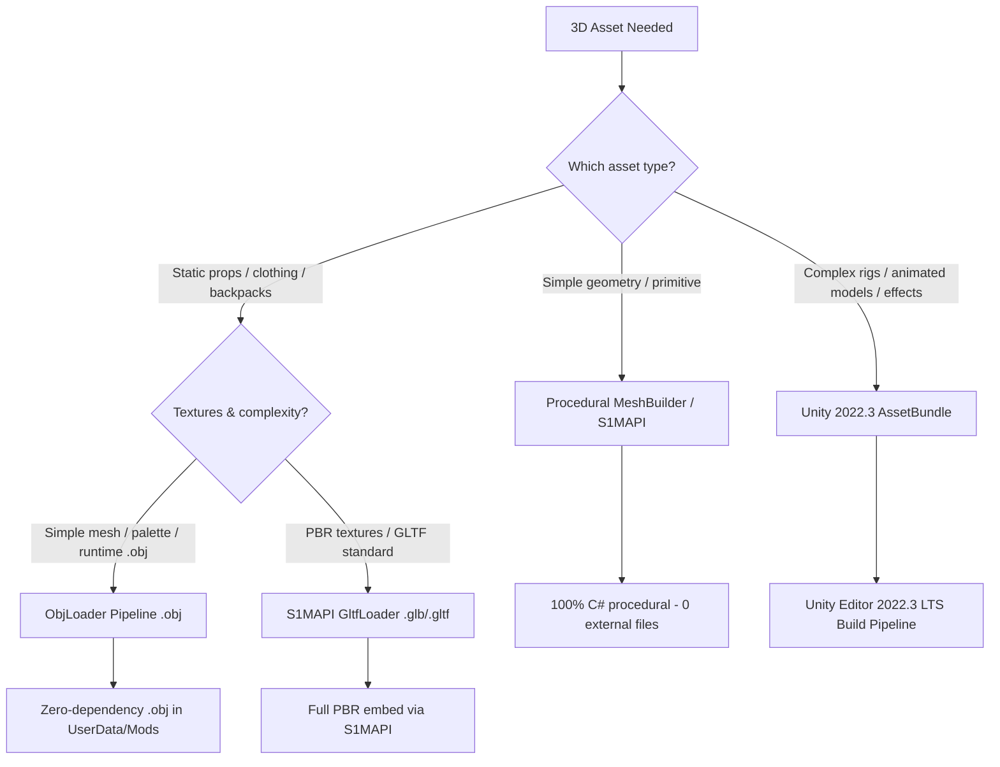

> Version anchor: runtime per workspace AGENTS.md (Game 0.4.7f11, S1API 3.2.1-beta.8 + local PR #353 build). Content predates f11: re-verify API details against the current decompiles before patching.

# Schedule I — 3D Asset & Blender Rendering Pipeline

This skill is the **complete runbook** for creating, exporting, and rendering 3D assets in *Schedule I* (v0.4.7f9, Unity 2022.3 LTS, Universal Render Pipeline).

---

## 1. Decision Tree: Which 3D Asset Pipeline to Use?

| Pipeline | File format | Loader / Tool | When to use? |
|---|---|---|---|
| **1. ObjLoader (Lightweight)** | `.obj` | `ObjLoader.cs` (in `Shared`/Mod) | Backpacks, hats, weapons, hand-items, signs, deco. Loads directly from `UserData/<Mod>/models/`. |
| **2. S1MAPI GltfLoader** | `.glb` / `.gltf` | `S1MAPI.ProceduralMesh.GltfLoader` | Full PBR models with embedded textures, furniture, vehicles, building interiors. |
| **3. Procedural Meshes** | C# code | `ProceduralMeshBuilder` / `Mesh` | Sleeping bags, crates, UI meshes, dynamic geometric shapes without external files. |
| **4. Unity AssetBundle** | `.bundle` | `AssetBundle.LoadFromFile` | Animated characters, complex skeleton rigs, particle effects, custom shaders. |

---

## 2. The 7 Golden Rules for 3D Assets in Schedule I

1. **Transform Reset in Blender (<kbd>Ctrl+A</kbd>):**  
   Always run <kbd>Ctrl+A</kbd> → **Apply All Transforms** (Rotation, Scale, Location) in Blender before export. Never export unscaled or rotated objects!
2. **Coordinate Standard (Z-Up vs. Y-Up):**  
   Blender uses $+Z$ as up, Unity uses $+Y$ as up. Export settings for OBJ/GLTF: **Forward: `-Z Forward` / Up: `Y Up`**.
3. **Face Orientation & Normals Check (<kbd>Shift+N</kbd>):**  
   Enable the **Face Orientation** overlay in Blender before export. Blue faces = outside, red faces = inside. If outward-facing faces are red, select all (<kbd>A</kbd>) and press <kbd>Shift+N</kbd>.
4. **URP Shader Compatibility (*Pink Shader Fix*):**  
   *Schedule I* runs on the **Universal Render Pipeline (URP)**. Standard Built-in Unity shaders show up as bright pink. Always use `Shader.Find("Universal Render Pipeline/Lit")` or `"Universal Render Pipeline/Unlit"`.
5. **Zero-Collider Rule for Clothing & Wearables:**  
   Clothing items, backpacks, or worn accessories must **not have active colliders** (`Destroy(collider)` on load), otherwise they intercept raycasts, block inventory clicks, or cause physics glitches.
6. **Respect Avatar Proportions:**  
   The *Schedule I* character is slim and stylized. Torso width: ≈0.12–0.14 m, total height: ≈1.75 m. Never use a standard 1m cube as a backpack — align to the real avatar dimensions.
7. **Material Memory Hygiene (`sharedMaterial` vs `material`):**  
   Never casually access `renderer.material` in code (creates memory leaks through dynamic instances); use `renderer.sharedMaterial` or cache materials in `static readonly` fields.

---

## 3. Module Overview & Reference Guides

* **[Blender Export & Geometry Preparation](references/blender-export.md):**  
  Axis conversion, scales, normals fixes, UV mapping, mesh optimization.
* **[URP Rendering & Material Pipeline](references/urp-rendering-materials.md):**  
  Universal Render Pipeline shaders, PBR properties (metallic, smoothness, normal maps), texture streaming, and pink-shader avoidance.
* **[Rigging & Bone Attachment](references/rigging-and-attachment.md):**  
  Attaching 3D meshes to avatar bones (`Spine2`, `Head`, `Hands`), zero-collider safety, and 360° mannequin inspection.
