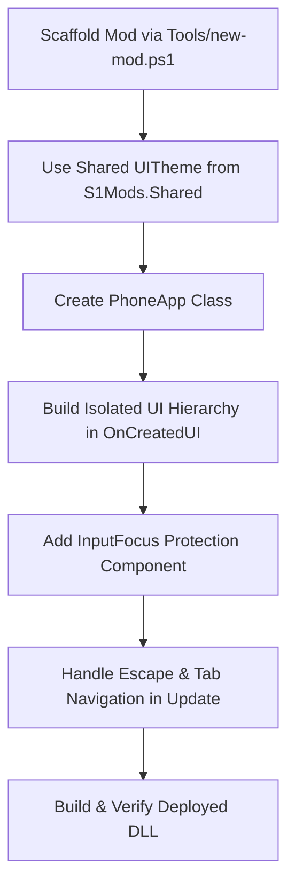

> Version anchor: Game v0.4.7f9 / S1API 3.2.1-beta.8 (deployed 2026-10-05; in-repo ThirdParty/S1API source = beta.8 tag (checked out 2026-10-05, commit f65ae40 = deployed build)) / MelonLoader 0.7.3 (versions verified 2026-10-05 against live install: Latest.log Game Version 0.4.7f9 + MelonLoader v0.7.3 Open-Beta + S1API product 3.2.1-beta.8, Steam buildid 25698382; content NOT re-verified after the 0.4.7f9 update - verify API details against live Il2CppAssemblies). Re-check after any game or S1API update.

# Schedule I — PhoneApp Development Runbook (S1API & IL2CPP)

This skill is the authoritative engineering standard for building, styling, and maintaining in-game smartphone applications (`S1API.PhoneApp.PhoneApp`) in *Schedule I*.

---

## 0. Quick Navigation & References

| Reference Guide | Content |
|---|---|
| [`references/lifecycle-and-canvas.md`](references/lifecycle-and-canvas.md) | S1API discovery, container hierarchy, `Orientation`, `IsOpen()` sync, and avoiding the "Transparent Phone" destruction bug. |
| [`references/responsive-ui-theme.md`](references/responsive-ui-theme.md) | Method 3: Responsive canvas scaling (`UITheme.Sp` for fonts, `UITheme.Dp` for pixels), DPI clamping curves. |
| [`references/input-focus-and-controls.md`](references/input-focus-and-controls.md) | WASD input protection (`MyAppInputFocus`), IL2CPP `IntPtr` constructor, desktop navigation (<kbd>Escape</kbd>, <kbd>Tab</kbd>, <kbd>Ctrl+S</kbd>). |
| [`references/components-and-ugui.md`](references/components-and-ugui.md) | `UIFactory` widgets, safe IL2CPP button listeners, 0-allocation list scrolling, modal backdrops. |

---

## 1. Golden Rules 1–9 (+ empirical Rules 10–14 below)

1. **Explicit Orientation:** Always override `protected override EOrientation Orientation => EOrientation.Vertical;` (or `Horizontal` for wide tablet dashboards). Never leave it unassigned.
2. **Never Destroy GameObjects on Close:** Never call `Object.Destroy()` or clear UI hierarchies in `OnPhoneClosed()`. Only hide modals or reset navigation. Destroying UI objects on close causes the **"Transparent Phone" (empty housing)** bug when the phone is raised again.
3. **Isolated Background Panel (`_mainBG`):** Build your UI inside a dedicated root panel parented to `container.transform` with `fullAnchor: true`, and start with `_mainBG.SetActive(false)`.
4. **Use Method 3 (`S1Mods.Shared.UITheme`):** Calculate all fonts with `UITheme.Sp(...)` and dimensions with `UITheme.Dp(...)`. The game's phone canvas is high-resolution and rotated by 90°. Single source of truth: `S1Mods.Shared.UITheme` (Shared/UITheme.cs) — never duplicate the math in a local class.
5. **Protect Input Focus:** Every text `InputField` must be guarded by an `[RegisterTypeInIl2Cpp]` `MonoBehaviour` with a public `IntPtr` constructor that toggles `S1API.Input.Controls.IsTyping` to prevent WASD player movement while typing.
6. **Safe Button Wiring:** Never call `button.onClick.AddListener(...)` directly in IL2CPP. Always use `ButtonUtils.AddListener(btn, ...)` or `EventHelper.AddListener(...)`.
7. **Atomic Persistence:** Save app state via `S1Mods.Shared.SafeStorage.SaveAtomic(...)` with `.bak` backups to prevent save file corruption during sudden crashes.
8. **Audio Feedback:** Play native game audio like `MoneyManager.Instance.PlayCashSound()` for successful transactions and procedural buzzers for errors to enhance UX (see `PocketShop` and `BankApp`).
9. **Multi-Payment Safety:** When implementing shops or banks, carefully check both physical cash (`cashBalance`) and online bank accounts (`onlineBalance`), considering inventory slot capacity limits (see `BankApp`).

> Numbering note: Rules 10–14 are later empirical additions (kept numbered for cross-references in other skills — "Rule 10"/"Rule 11" are cited by name). Sections are in numerical order below.

### Rule 10 (empirical, 2026-08-20): Never Unsubscribe `MelonEvents.OnUpdate` in `OnPhoneClosed()`

**Symptom:** All 5 phone apps (NotesApp, CalculatorApp, PotScanner, PocketShop, BankApp) showed a **blank app after the 1st phone close** — regression introduced by adding `MelonEvents.OnUpdate.Unsubscribe(Update)` to `OnPhoneClosed`.

**Root cause:** S1API auto-discovery (`HomeScreen_Start_Patch`) instantiates your `PhoneApp` class **exactly once** per scene. `OnCreated()` fires only at that instantiation. `OnPhoneClosed()` fires on *every* close. Unsubscribing the Update loop in `OnPhoneClosed` means it is never re-subscribed → `_mainBG.SetActive(open)` sync in `Update()` never runs again → app stays hidden forever (until scene reload).

**The fix pattern (idempotent, self-healing):**
```csharp
protected override void OnCreated()
{
    base.OnCreated();
    // Defensive Unsubscribe-before-Subscribe ONLY here (idempotency on re-creation).
    MelonEvents.OnUpdate.Unsubscribe(Update);
    MelonEvents.OnUpdate.Subscribe(Update);
}

protected override void OnPhoneClosed()
{
    base.OnPhoneClosed();
    if (_mainBG != null) _mainBG.SetActive(false);
    // NEVER unsubscribe MelonEvents.OnUpdate here — OnCreated fires only once per scene!
    // Also never -= static event handlers (Money.OnBalanceChanged, OnPotsScanned, ...)
    // here unless the class instance itself is destroyed.
}
```

**Corollary:** The same applies to **static event handlers** (`PotTracker.OnPotsScanned`, `Money.OnBalanceChanged`, `TransactionHistoryService.OnHistoryChanged`, `_engine.OnStateChanged`). Unsubscribing them in `OnPhoneClosed` kills live-updates after the first close. The defensive `-=` before `+=` in `OnCreated` is sufficient and correct.

### Rule 11 (empirical, 2026-08-21 / 2026-09-11 audit): Slot-Isolated Persistence for PhoneApps

**Symptom:** `CalculatorApp` `calculator_state.json` was global → Slot-A history leaked into Slot-B. In-game menu/transition also caused `slot_-1.json` when `SaveSlotNumber` is `-1`.

**Root cause:** `CalculatorState.GetStateFilePath()` returned a global path, or didn't guard against `SaveSlotNumber < 0`. All slot-aware mods (`NotesApp`, `CalculatorApp`, `BankApp`, `HomelessMod`, `BusinessIncome`) must use the triple-guarded slot suffix + `TryMigrateLegacy`.

**Fix pattern (canonical):** Triple IL2CPP Guard + `SaveSlotNumber >= 0` + `_lastKnownSlot` fallback + `TryMigrateLegacy` — full copyable code lives in **[`../schedule1-persistence/references/slot-isolation.md`](../schedule1-persistence/references/slot-isolation.md)** (edit there, not here). Rules: `Load()`/`Save()` must use `GetStateFilePath()`; menu/transition states can report `-1` — never write `slot_-1.json`; migrate the legacy global file once. **Every** PhoneApp with a non-slot file or unguarded `-1` suffix is buggy.

### Rule 12 (empirical, 2026-09-29): Close-Path Experiments Must Not Kill the Open-Direction Sync

**Symptom:** `TaxiApp` canvas permanently transparent ("dauerhaft durchsichtig") — the app never rendered, even on first open.

**Root cause:** a diagnostic Harmony prefix skipped `PhoneApp.SetAppOpen(false)` on close (to measure the 1-frame transparent close frame) and, while "armed", the app's `Update()` skipped the `_mainBG.SetActive(open)` sync in BOTH directions. Since `_mainBG` starts inactive (Rule 3) and that sync is the only thing that ever shows it, the app could never appear.

**Rules:**
1. Any close-path experiment must keep the OPEN-direction visibility sync: gate only the close branch (`_mainBG.activeSelf != open && (open || !experimentArmed)`).
2. Skipping `SetAppOpen(false)` leaves `AppsCanvas.SetIsOpen` / `HomeScreen.SetIsOpen` / orientation state stale — mirror the bookkeeping or re-normalize after the animation.
3. The transparent close frame itself: `SetAppOpen(false)` hides `AppsCanvas` + `_appContainer` SYNCHRONOUSLY while the phone mesh animates away afterwards — the gap IS S1API's synchronous hide. Upstream fix shape: delay the hide until the animation ends.

### Rule 13 (empirical, 2026-09-29): Scroll-Content Lists Need childControlWidth + No Inner Force-Expand

**Symptom:** dynamic list rows lost their first letters on the LEFT and their last letters on the RIGHT (screenshot 2026-09-29), while headers under the app root were perfect.

**Root cause:** `UIFactory.ScrollableVerticalList`'s content `VerticalLayoutGroup` does NOT set `childControlWidth`, so rows kept their PREFERRED width (long names = wide rows) and bled past both mask edges. Inside the row, `childForceExpandWidth = true` also forced the FIXED-width tag to expand (50/50 split instead of "name gets the rest").

**Fix pattern** (directly after `ScrollableVerticalList`):
```csharp
var contentLayout = content.GetComponent<VerticalLayoutGroup>();
contentLayout.childControlWidth = true;
contentLayout.childForceExpandWidth = true;
```
and in each row's `HorizontalLayoutGroup`: `childControlWidth = true; childForceExpandWidth = false;` (the tag keeps `LayoutElement.preferredWidth`, the name gets the rest). The app root VLG already has `childControlWidth = true` - which is exactly why headers never show this bug.

### Rule 14 (empirical, 2026-10-01): Restyling to a Mockup — Measure the Image, Then Diff a Headless Render

**Trigger:** "make the app look like this mockup" (Weather 0.4.0 restyle). Eyeballing proportions wastes a playtest; measure instead.

1. **Measure the reference image, don't guess.** This host has no PIL: decode the PNG with the stdlib (`zlib.decompress(IDAT)` + per-scanline unfilter, colortype 2/6) and extract exact numbers — card left/right/top/bottom, row band tops/bottoms, bar rect + fill end, text bounding boxes, border colours, ring outer/inner diameter. `vision_analyze` is good for structure ("name above the bar?", "is there a rule line?") but its pixel estimates vary between passes; trust the decoded pixels.
2. **If the mockup's aspect ratio equals the phone canvas aspect (400:750 = 0.5333), pixel fractions map 1:1 onto `UITheme.ActualWidth/Height`.** Every constant then becomes a canvas fraction (`x/imgW`, `1 - y/imgH`) and the layout is resolution-independent for free. Convert measured sizes with the same factor (`canvasPx = imgPx * 750/imgH`) to derive `Sp`/`Dp` values; sanity-check them against Arial advance widths (Arial caps: M .833, O .778, D .722, C .722, N .722, U .722, S .667, E/A/T .667/.611, L .556, I .278, digits .556, space .278, % .889 em) so labels measurably fit their boxes before the build.
3. **Verify without the game.** Replicate the same constants in a standalone HTML page at the mockup's pixel size, screenshot it headlessly, and diff the identical metrics against the reference:
   `chrome.exe --headless=new --no-sandbox --user-data-dir=<scratch>\prof --force-device-scale-factor=1 --hide-scrollbars --window-size=W,H --screenshot=out.png "file:///...html"`
   (`--user-data-dir` is required on this host — without it the process exits code 2 and writes no PNG; Helium lives at `%LOCALAPPDATA%\imput\Helium\Application\chrome.exe`, and Hermes' own browser backend may be unavailable.) In the HTML, place glyphs like Unity does: `top = centreY - 0.547 * fontSizePx` (Arial cap centre), NOT `- 0.72` — otherwise every text sits ~0.17 em too high and the diff looks like a real layout bug. Matching card edges / row bands / text boxes within a few px means the constants are right; expect font-metric noise of 3-5 px on text widths because the mockup's font is not Arial.
4. **Legacy `UnityEngine.UI.Text` has NO character spacing.** A tracked label in the mockup (`L I V E  C O N D I T I O N S`) can only be approximated — thin-space padding (U+2009) risks missing-glyph boxes in Arial. Accept the tighter label and record the deviation instead of faking it.
5. **Only colour/tint surfaces you can derive:** measure the active row base, then solve for the blend (`base = Bg + (accent - Bg) * t`, typically t ≈ 0.14). Hard-coded hexes copied from a JPEG-ish mockup drift; the blend formula keeps every accent consistent.

---

## 2. Step-by-Step Runbook: Creating a New PhoneApp



### Step 1: Scaffold the Project
```pwsh
pwsh Tools\new-mod.ps1 -Name <MyAppName>
```

### Step 2: Use Shared `UITheme` (Method 3)
Reference `S1Mods.Shared.UITheme` directly (canonical since 2026-08-20 — do NOT create a local UITheme class):
```csharp
using S1Mods.Shared;

// In OnCreatedUI:
S1Mods.Shared.UITheme.InitializeForTextApp(containerRt);    // 750f, 0.85–2.0 (text-heavy)
// or: S1Mods.Shared.UITheme.InitializeForDashboard(containerRt);  // 900f, 0.75–1.20 (dense lists)

int sp = S1Mods.Shared.UITheme.Sp(14);     // fonts
float dp = S1Mods.Shared.UITheme.Dp(36f);  // dimensions/padding
```

*(Optional mod-specific wrapper `UI/UITheme.cs` only if you need a custom palette — it must delegate to `S1Mods.Shared.UITheme` for `Sp/Dp/Scale`, never reimplement the math.)*

### Step 3: Implement the Production-Ready PhoneApp Class
In `<MyAppName>/src/MyAppApp.cs`:
```csharp
using System;
using System.IO;
using MelonLoader;
using MyAppName.UI;
using S1API.PhoneApp;
using S1API.UI;
using S1Mods.Shared;
using UnityEngine;
using UnityEngine.UI;

namespace MyAppName;

public sealed class MyAppApp : PhoneApp
{
    protected override string AppName => "MyApp";
    protected override string AppTitle => "My App";
    protected override string IconLabel => "My App";
    protected override string IconFileName => string.Empty; // Using custom IconSprite
    protected override EOrientation Orientation => EOrientation.Vertical;

    private GameObject _mainBG = null!;
    private Text _titleLabel = null!;

    protected override void OnCreated()
    {
        base.OnCreated();
        // Idempotent: defensive Unsubscribe-before-Subscribe (OnCreated fires ONCE per scene).
        MelonEvents.OnUpdate.Unsubscribe(Update);
        MelonEvents.OnUpdate.Subscribe(Update);
        MelonLogger.Msg($"[{AppName}] Registered with S1API PhoneApp system.");
    }

    protected override void OnCreatedUI(GameObject container)
    {
        var containerRt = container.GetComponent<RectTransform>();
        if (containerRt != null)
        {
            S1Mods.Shared.UITheme.InitializeForTextApp(containerRt);
        }

        // 1. Isolated Background Panel
        _mainBG = UIFactory.Panel("MyApp_MainBG", container.transform, new Color(0.07f, 0.08f, 0.11f, 1f), fullAnchor: true);
        _mainBG.SetActive(false);

        var vlg = _mainBG.AddComponent<VerticalLayoutGroup>();
        vlg.childControlWidth = true;
        vlg.childControlHeight = true;
        vlg.childForceExpandWidth = true;
        vlg.childForceExpandHeight = false;

        // 2. Header
        BuildHeader(_mainBG.transform);

        // 3. Content Area
        BuildContentArea(_mainBG.transform);
    }

    private void BuildHeader(Transform parent)
    {
        var header = UIFactory.Panel("Header", parent, new Color(0.10f, 0.12f, 0.16f, 1f));
        var le = header.AddComponent<LayoutElement>();
        le.preferredHeight = S1Mods.Shared.UITheme.Dp(36f);
        le.minHeight = S1Mods.Shared.UITheme.Dp(36f);

        var hlg = header.AddComponent<HorizontalLayoutGroup>();
        hlg.padding = new RectOffset((int)S1Mods.Shared.UITheme.Dp(10f), (int)S1Mods.Shared.UITheme.Dp(10f), 0, 0);
        hlg.childAlignment = TextAnchor.MiddleCenter;

        _titleLabel = UIFactory.Text("Title", "MY APP", header.transform, S1Mods.Shared.UITheme.Sp(14), TextAnchor.MiddleCenter, FontStyle.Bold);
        _titleLabel.color = new Color(0.95f, 0.95f, 0.95f, 1f);
    }

    private void BuildContentArea(Transform parent)
    {
        var content = UIFactory.Panel("Content", parent, Color.clear);
        content.AddComponent<LayoutElement>().flexibleHeight = 1f;
    }

    private void Update()
    {
        if (_mainBG == null || _mainBG.WasCollected) return;

        bool open = IsOpen();
        if (_mainBG.activeSelf != open)
        {
            _mainBG.SetActive(open);
            if (open) OnAppOpened();
        }

        if (!open) return;

        // Desktop Shortcuts
        if (Input.GetKeyDown(KeyCode.Escape))
        {
            CloseApp();
        }
    }

    private void OnAppOpened()
    {
        // Refresh data when app becomes visible
    }

    protected override void OnPhoneClosed()
    {
        base.OnPhoneClosed();
        if (_mainBG != null) _mainBG.SetActive(false);
        // Do NOT destroy any UI elements here!
        // Do NOT unsubscribe MelonEvents.OnUpdate / static event handlers here (Rule 10)!
    }
}
```

---

## 3. Verification Checklist

Before releasing or testing in-game:
- [ ] `Orientation` explicitly defined (`Vertical` or `Horizontal`).
- [ ] `_mainBG` created with `fullAnchor: true` and starts `SetActive(false)`.
- [ ] `OnPhoneClosed()` does NOT destroy child GameObjects, clear static caches, or unsubscribe `MelonEvents.OnUpdate`/static event handlers (Rule 10).
- [ ] `OnCreated()` has defensive `Unsubscribe`-before-`Subscribe` for `MelonEvents.OnUpdate` (idempotent across scene reloads).
- [ ] All fonts use `S1Mods.Shared.UITheme.Sp(...)` and sizes use `S1Mods.Shared.UITheme.Dp(...)` (no local UITheme class — wrapper must delegate to `S1Mods.Shared.UITheme`, see `CalculatorApp.cs:18` fix 2026-08-21).
- [ ] All button clicks use `ButtonUtils.AddListener(...)`.
- [ ] `[RegisterTypeInIl2Cpp]` focus component has a public `IntPtr` constructor.
- [ ] Persistence is slot-isolated (`slot_{n}.json` + `TryMigrateLegacy`, Rule 11) — never global file.
- [ ] `IconSprite` override returns `Sprite` directly if `IconFileName` not found (see `PotScanner.cs:129` fallback) — avoids "Icon file not found".
- [ ] <kbd>Escape</kbd> key navigates back or closes the app cleanly.
- [ ] Re-open test: open app → close phone → re-open → app still renders (catches Rule-10 regression).
- [ ] Slot-switch test: Slot-A → Save → Slot-B → app shows isolated state (catches Rule-11 regression).
- [ ] Compiles with 0 errors / 0 warnings (`dotnet build Source/Mods/<MyApp>/src/<MyApp>.csproj -c Release`).
- [ ] Any runtime asset the app loads by filename (app icon, textures, bundles) lives in the mod's `assets/` folder — NOT only in `<GameDir>`. A manual copy into `<GameDir>` works locally but a fresh clone + build deploys no asset, and `IconFileName` then logs "Icon file not found" at runtime. Check `Directory.Build.targets` for what it actually copies.
- [ ] Newly created `.cs` files ran through `dotnet format` before committing (`.editorconfig` enforces `end_of_line = lf`; a scaffold-generated CRLF file fails the pre-commit hook).
- [ ] Icon files are real PNGs, not JPEGs renamed to `.png` (Unity's `LoadImage` tolerates it, but the extension lies and other tooling may not).

---

## 4. Related Skills

* `schedule1-s1api` — S1API framework reference (Saveables, Quests, NPCs, Items, Money, GameTime, cross-branch) — load when you need a specific S1API namespace/class.
* `schedule1-s1mapi` — S1MAPI framework reference (procedural meshes, buildings, GLTF, world tools) — load when your mod extends the game world.
