```mermaid
timeline
    title Schedule 1 Modding Evolution & Milestone Timeline
    2026-08-04 : MoreDrugs 1.0.2 : S1API Save-Provider verification
    2026-08-13 : Workspace Standardization : IL2CPP baseline established, S1Mods.sln generated
    2026-08-14 : Foundation Phase : NotesApp v1.0.0, PotScanner v0.5.0, CalculatorApp v0.2.0, MoreSaveSlots v1.0.1, Shared lib
    2026-08-16 : Commerce & Transit : PocketShop v0.1.0/v0.2.0, CustomSkateboard v1.0.1 refactor
    2026-08-17 : World & Economy : HomelessMod v0.1.0/v0.1.1, BankApp v0.1.0, BusinessIncome v0.1.0, PocketShop v0.2.1
    2026-08-18 : Navigation & HUD : Minimap v1.0.0 / DayCounter HUD merge, 64-blip pool
    2026-08-19 : Knowledge Base : 304+ curated analysis docs, 7 AI Agent Skills created
    2026-08-20 : Audit & Stack Limits : CustomSkateboard v1.0.2 (20 bugfixes), StackLimitMod v0.1.0 released, Hybrid Memory System implemented
    2026-08-20 : Full Workspace Upgrade (Track C) : UITheme central, deterministic SLN, bump-version, CI, Shared.Tests, LICENSE, CONTRIBUTING
    2026-08-20 : Bug-Hunt Round 2 : 2 CRITICAL + 9 HIGH + MEDIUM Quick-Wins gefixt (5 PhoneApps, PocketShop, MoreSaveSlots, Minimap, PotScanner, BankApp, BusinessIncome)
    2026-08-20 : Skills-Upgrade Round 2 : Rule 10 (OnPhoneClosed-Unsubscribe), UITheme zentral, TOML-Limit, Transaction-Ordering, Error-Patterns 16+17
    2026-08-21 : Bug-Hunt Round 3 : C1-C3 + H1/H3-H4 (UITheme 3x, MoreSaveSlots atomic, BusinessIncome snapshot, Calculator slot-isolation, StackLimit dead patch, Minimap circle-cache) — 6 Bugs gefixt + 4804 files verifiziert
    2026-08-21 : Skills-Upgrade Round 3 : 4 Skills 2026-08-21 (modding/phoneapp/troubleshooting/knowledge) + game-systems 146 Zeilen + 3 neue Skills (economy, persistence, items) = 11 Skills total
    2026-08-21 : BackpackMod v1.0.0 Released : 3D Harness & Schultergurte + Brustschnalle + ObjLoader + Slot-10 Bindung + 360 Mannequin Rotation
    2026-08-21 : ScheduleIArcade & 12th Skill : schedule1-interiors erstellt (Door Hooking, Binary Meshes, 60 FPS CRT Pixel Buffer)
    2026-08-22 : 13th & 14th Skill : schedule1-3d-assets (Blender/URP/Rigging) + schedule1-mcp (Live Game Introspection)
    2026-08-22 : AutoPackagingStation Releases : v0.1.0 Pipeline → v0.2.0 (16+ Bugfixes) → Outdoor Pack-Up + Dan Shop → Kessel Realism + Save/Load Recovery
    2026-08-22 : AutoPackagingStation HUD & Outdoor Pickup : 3D-anchored HUD via WorldToScreenPoint + OutdoorItemInteractable bridge to bypass vanilla "doesn't fit" toast
    2026-08-23 : AutoPackagingStation v0.2.1 Bugfix Round : Output-Extraktion N-Instanzen gefixt, Recipe Multiplier Durchsetzung, Native Slot Save/Load Sync, Dismantle Double-Refund Schutz, GUID-Sync
```

```mermaid
timeline
    title Schedule 1 Modding Evolution & Milestone Timeline
    2026-08-04 : MoreDrugs 1.0.2 : S1API Save-Provider verification
    2026-08-13 : Workspace Standardization : IL2CPP baseline established, S1Mods.sln generated
    2026-08-14 : Foundation Phase : NotesApp v1.0.0, PotScanner v0.5.0, CalculatorApp v0.2.0, MoreSaveSlots v1.0.1, Shared lib
    2026-08-16 : Commerce & Transit : PocketShop v0.1.0/v0.2.0, CustomSkateboard v1.0.1 refactor
    2026-08-17 : World & Economy : HomelessMod v0.1.0/v0.1.1, BankApp v0.1.0, BusinessIncome v0.1.0, PocketShop v0.2.1
    2026-08-18 : Navigation & HUD : Minimap v1.0.0 / DayCounter HUD merge, 64-blip pool
    2026-08-19 : Knowledge Base : 304+ curated analysis docs, 7 AI Agent Skills created
    2026-08-20 : Audit & Stack Limits : CustomSkateboard v1.0.2 (20 bugfixes), StackLimitMod v0.1.0 released, Hybrid Memory System implemented
    2026-08-20 : Full Workspace Upgrade (Track C) : UITheme central, deterministic SLN, bump-version, CI, Shared.Tests, LICENSE, CONTRIBUTING
    2026-08-20 : Bug-Hunt Round 2 : 2 CRITICAL + 9 HIGH + MEDIUM Quick-Wins gefixt (5 PhoneApps, PocketShop, MoreSaveSlots, Minimap, PotScanner, BankApp, BusinessIncome)
    2026-08-20 : Skills-Upgrade Round 2 : Rule 10 (OnPhoneClosed-Unsubscribe), UITheme zentral, TOML-Limit, Transaction-Ordering, Error-Patterns 16+17
    2026-08-21 : Bug-Hunt Round 3 : C1-C3 + H1/H3-H4 (UITheme 3x, MoreSaveSlots atomic, BusinessIncome snapshot, Calculator slot-isolation, StackLimit dead patch, Minimap circle-cache) — 6 Bugs gefixt + 4804 files verifiziert
    2026-08-21 : Skills-Upgrade Round 3 : 4 Skills 2026-08-21 (modding/phoneapp/troubleshooting/knowledge) + game-systems 146 Zeilen + 3 neue Skills (economy, persistence, items) = 11 Skills total
    2026-08-21 : BackpackMod v1.0.0 Released : 3D Harness & Schultergurte + Brustschnalle + ObjLoader + Slot-10 Bindung + 360 Mannequin Rotation
    2026-08-21 : ScheduleIArcade & 12th Skill : schedule1-interiors erstellt (Door Hooking, Binary Meshes, 60 FPS CRT Pixel Buffer)
    2026-08-22 : 13th & 14th Skill : schedule1-3d-assets (Blender/URP/Rigging) + schedule1-mcp (Live Game Introspection)
    2026-08-22 : AutoPackagingStation Releases : v0.1.0 Pipeline → v0.2.0 (16+ Bugfixes) → Outdoor Pack-Up + Dan Shop → Kessel Realism + Save/Load Recovery
    2026-08-22 : AutoPackagingStation HUD & Outdoor Pickup : 3D-anchored HUD via WorldToScreenPoint + OutdoorItemInteractable bridge to bypass vanilla "doesn't fit" toast
```

# MEMORY.md — Schedule 1 Modding Knowledge Hub

> **Central Memory Bank for AI Agents & Developers**  
> Workspace: `C:\Program Files (x86)\Steam\steamapps\common\Schedule I\Schedule 1 Modding`  
> Last Synchronized: 2026-08-22 (3D-anchored HUD + Outdoor Pickup bridge, AutoPackagingStation v0.2.x)  
> Operating System: Windows (PowerShell 7+ / .NET 6.0 SDK)
> Knowledge Snapshot: 4804 files / 67 MB (verified `Get-ChildItem -Recurse`)


## 1. Workspace Metadata & Toolchain Specifications

 Parameter  Specification  Notes / Enforcement 

 **Game Title**  *Schedule I* (TVGS)  Default Steam release 
 **Game Version**  `v0.4.6f13` (Targeted & Verified)  Compatible with `v0.4.6f11`–`v0.4.6f13` 
 **Unity Runtime**  `2022.3.62f2` (IL2CPP)  Native 64-bit C++ generated code 
 **Mod Loader**  MelonLoader `0.7.3` (`net6`)  UserLibs & Plugins managed 
 **Target Framework (TFM)**  `net6.0`  `LangVersion: 12`, `Nullable: enable` 
 **Branch Policy**  **Strictly IL2CPP** (Default Steam)  Never force users to switch to the `alternate` Mono branch 
 **Solution Layout**  `Source/Mods/S1Mods.sln`  Managed via `Tools/gen-sln.ps1` 
 **Auto-Deploy Target**  `Directory.Build.targets`  Automatically copies output DLLs, icons, and `mod.json` to `<GameDir>\Mods\` 
 **Embedded Debugging**  `<DebugType>embedded</DebugType>`  Embedded PDBs eliminate external `.pdb` management 


## 2. Core Architecture Standards (Non-Negotiable Guardrails)

Every mod developed in this workspace must adhere to these five architectural pillars:

### 2.1 IL2CPP Pointer Validation & Lifecycle Safety
- **Pointer Validation:** In Unity IL2CPP, managed C# proxy instances often outlive their underlying native C++ objects. Checking `obj != null` is **insufficient**. Always validate `obj != null && obj.Pointer != IntPtr.Zero`.
- **Public `IntPtr` Constructors:** Any class inheriting from `UnityEngine.MonoBehaviour` and registered via `[RegisterTypeInIl2Cpp]` or `ClassInjector.RegisterTypeInIl2Cpp<T>()` **MUST** declare a public `IntPtr` constructor:
  ```csharp
  public class NotesAppInputFocus : MonoBehaviour
  {
      public NotesAppInputFocus(IntPtr ptr) : base(ptr) { }
  }
  ```
  *Violation will cause immediate native IL2CPP bridge crash upon component attachment.*
- **No `foreach` or LINQ on `Il2CppSystem.Collections.Generic.List<T>`:** Always use standard 0-allocation indexed `for (int i = 0; i < list.Count; i++)` loops.
- **Scene-Transition Cleanup:** Static UI caches and cached game object references must be explicitly cleared in `OnSceneWasUnloaded` or `OnPreLoad` to prevent accessing collected native pointers.

### 2.2 Responsive UI Scaling Engine ("Method 3": `UITheme`)
- **DPI & Canvas Rotation:** S1API instantiates smartphone canvases on high-DPI uGUI viewports that are rotated 90° (`Quaternion.Euler(0, 0, 90)`). Static pixel sizes render illegibly tiny or grossly oversized depending on resolution.
- **Single Source of Truth (2026-08-21):** `S1Mods.Shared.UITheme` (`Shared/src/UITheme.cs`) — `InitializeForTextApp(750f,0.85-2.0)` for text-heavy, `InitializeForDashboard(900f,0.75-1.20)` for dense dashboards. Mod wrappers (`BankApp/UI/UITheme.cs`, `PocketShop/UI/UITheme.cs`, now also `NotesApp/UITheme`, `PotScanner/UITheme`, `CalculatorApp/UITheme`) **must delegate** to Shared for `Sp/Dp/Scale`; never reimplement `Mathf.Clamp` locally (verified 2026-08-21: 3 duplicates with divergent `2.5`/`850:1.30` fixed).
- **Scaling Formula:** Dynamic damped height clamping:
  ```csharp
  public static class UITheme
  {
      public const float RefHeight = 750f; // 750f for text apps, 900f for dense dashboards
      public const float RefWidth = 400f;
      public static float Scale { get; private set; } = 1.0f;

      public static void Initialize(RectTransform containerRt, float refHeight = 750f, float minScale=0.85f, float maxScale=2.0f)
      {
          Canvas.ForceUpdateCanvases();
          var r = containerRt.rect;
          float h = Mathf.Max(r.width, r.height);
          float w = Mathf.Min(r.width, r.height);
          if (h > 200f && w > 100f)
              Scale = Mathf.Clamp(h / refHeight, minScale, maxScale);
      }

      public static int Sp(float pt) => Mathf.RoundToInt(pt * Scale);
      public static float Dp(float px) => px * Scale;
  }
  ```
- **Non-Destructive PhoneApp Lifecycle:** Never call `Object.Destroy()` or clear UI hierarchies in `OnPhoneClosed()`. Only hide the background root panel (`_mainBG.SetActive(false)`). Destroying UI hierarchies on close causes the **"Transparent Phone" (empty housing)** bug when raised again.
- **Lifecycle Rule 10/11 (2026-08-20/21):** `OnCreated()` fires **once** per scene (S1API `HomeScreen_Start_Patch`); `OnPhoneClosed()` every close. Never `Unsubscribe(MelonEvents.OnUpdate)` in `OnPhoneClosed` → blank app on 2nd open. Persistence must be `slot_{n}.json` + `TryMigrateLegacy` (Rule 11, `CalculatorState.cs:65`).

### 2.3 Safe Persistence & Savegame Synchronization
- **Atomic File Writing (`SafeStorage.SaveAtomic` / `SaveTextAtomic`):** Never use `File.WriteAllText` / `File.Copy+Replace`. Always write to `.tmp`, keep `.bak`, atomically `Move .tmp→target` (`Shared/SafeStorage.cs:73`). Verified 2026-08-21: `MoreSaveSlotsConfig.cs:57` + `SaveRenameService.cs:71` migrated from raw `File.*` to `SafeStorage.SaveTextAtomic` (Game.json rename must be atomic).
- **Slot Isolation:** Mod save files must isolate data per save slot using `LoadManager.Instance.ActiveSaveInfo.SaveSlotNumber` (`GetActiveSlotSuffix()` pattern) — `notes_slot_{n}.json`, `calculator_state_slot_{n}.json` (fixed 2026-08-21, was global `calculator_state.json`), `bank_slot_{n}.json`, `payout_state_slot_{n}.json`, `street_items_slot_{n}.json`. Add `TryMigrateLegacy()` moving legacy global → slot once.
- **Savegame Transactional Integrity:** Runtime operations (placing objects, ATM deposits, revenue payouts) must remain strictly in memory during gameplay and serialize to disk **ONLY** on `S1API.Lifecycle.GameLifecycle.OnSaveComplete`. Economics need **snapshot revert** (`PayoutStateStore.cs:20` 2026-08-21): `MarkInMemoryPaid` snapshots `prevLastPaid+perBusiness Dict`, `Revert` restores (not `-1`), `CommitPayout` clears snapshot.
- **Sprite/Cache Keying:** Procedural `Sprite`/`Texture2D` caches must be `Dictionary<string,Sprite>` keyed `"{size}_{radius}_{thickness}"` (verified 2026-08-21: `_circleMaskSprite` single field → wrong mask after size change, fixed `_circleMaskCache` `MinimapTextures.cs:9`). Field-accessors (`BaseItemDefinition.get_DefaultStackLimit`) are **not patchable** (`Latest.log:438`, removed `StackLimitMod/Mod.cs:109`).

### 2.4 Resilient Harmony Patching (`PatchGuard`)
- **Graceful Degradation:** Use `S1Mods.Shared.PatchGuard.TryPatch` to wrap patch registrations. If a game update alters a method signature, `PatchGuard` logs a descriptive warning and skips the patch, preventing a hard game crash on startup.
- **Transpiler & Prefix Safety:** Guard prefixes with pointer validations and never allow unhandled exceptions to escape from Harmony patches into the Unity main loop.

### 2.5 Multiplayer Host Authority
- **Authority Check:** Guard all global economy, passive revenue, or world-modifying state changes with `NetworkGuard.IsHostOrSingleplayer()` / `IncomeEngine.IsHostOrSingleplayer()`.
- **Client Desync Prevention:** Clients must never execute state modifications or payouts locally; all actions must route through the host.


## 3. Battle-Tested Gotchas & Solutions Matrix

This matrix documents critical real-world edge cases discovered across mod development, along with their permanent engineering solutions.

 Subsystem / Domain  Critical Gotcha  Root Cause  Mandatory Architectural Solution 

 **Outdoor Building** (`HomelessMod`)  `DestroyImmediate(GridItem)` Hard Crash  Calling `Destroy` / `DestroyImmediate` on `GridItem` corrupts native C++ component tables and throws NREs when vanilla scripts query the item.  **Never destroy `GridItem`.** Disable it immediately: `gi.enabled = false; gi.SetFootprintTileVisiblity(false);`. Patch `GridItem.Destroy` prefix to return `false` if `IsOutdoorItem`. 
 **Outdoor Building** (`HomelessMod`)  FishNet Local Clone Desync  Vanilla buildable prefabs contain FishNet `NetworkIdentity` and navigation components expecting server authority.  Strip networking and navigation immediately upon instantiation via `BuildManager.Instance.DisableNetworking(obj)` and `DisableNavigation(obj)`. 
 **Outdoor Building** (`HomelessMod`)  Invisible Outdoor Objects on Exit  `BuildableItem.SetCulled(bool culled)` hides objects when exiting building interiors; `BuildableItem.Start` expects a vanilla parent `Property`.  Apply Harmony prefix guards on `BuildableItem.Start` and `BuildableItem.SetCulled` that return `false` if `StreetPropertyManager.IsOutdoorItem(__instance.gameObject)`. Disable `b.enabled = false`. 
 **Outdoor Building** (`HomelessMod`)  Virtual Root Property Component Crash  Attaching a `Property` component to `_streetRoot` causes phone real estate apps, business dashboards, and police raids to query it, breaking UI and game logic.  **Never attach `Property` to `_streetRoot`.** Keep `_streetRoot` as a pure, clean `GameObject` protected by `DontDestroyOnLoad`. Manage world items via custom singleton `StreetPropertyManager`. 
 **Outdoor Building** (`HomelessMod`)  Floating Grid Indicator Tiles  `FootprintTile` and `TileAppearance` child objects render green/red tiles on public asphalt/sidewalks.  Deactivate `FootprintTile` child GameObjects (`ft.SetActive(false)`), invoke `gi.SetFootprintTileVisiblity(false)`, and filter child renderers so footprint renderers are disabled while mesh renderers remain active. 
 **Outdoor Building** (`HomelessMod`)  Infinite Item Duplication Exploit  Saving to disk immediately on placement causes an inventory dupe if the player quits without saving (Alt+F4 reverts inventory but mod file keeps placed item).  **Anti-Dupe Rule:** Keep runtime place/pack-up strictly in memory (`_activeStreetObjects`). Serialize to disk **ONLY** on `GameLifecycle.OnSaveComplete`. Clear state on `OnPreLoad` and scene unloads. 
 **Outdoor Building** (`HomelessMod`)  Falling Through Terrain on Raycast  Raycasting with a mask that excludes the `Grid` layer fails because certain street meshes reside on the `Grid` layer.  Perform raycasts with `~LayerMask.GetMask("Ignore Raycast", "Player")` including the `Grid` layer, with `QueryTriggerInteraction.Ignore`. 
 **Custom Skateboard** (`CustomSkateboard`)  Material Memory Leaks  Accessing `r.material` on renderers creates dynamic material instances that leak memory on zero-slot or unequipped boards.  Use `r.sharedMaterial` for all visual inspections and cache materials in `static readonly` fields. 
 **Custom Skateboard** (`CustomSkateboard`)  Candidate Base ID Drift  Base skateboard item IDs may change between game versions (`ITEM_SKATEBOARD`, `Skateboard`, etc.).  Implement a candidate base ID resolution chain with diagnostic logging and provide a `BaseItemIdOverride` configuration override. 
 **Custom Skateboard** (`CustomSkateboard`)  TOCTOU Registry Race Condition  Checking `Registry.ItemExists(id)` followed by `Registry.GetItem(id)` introduces time-of-check to time-of-use vulnerability.  Collapse into a single atomic `Registry.GetItem(id)` call with null/pointer validation. 
 **Custom Skateboard** (`CustomSkateboard`)  Duplicate Dialogue Injection  Injecting dynamic shop dialog into Jeff Gilmore without case-insensitive comparison causes duplicate choices.  Use `StringComparison.OrdinalIgnoreCase` when checking for existing dialogue options before injecting. 
 **Custom Skateboard** (`CustomSkateboard`)  Double-Tuning Allocation Churn  Multiple hooks (`OnSkateboardAwakePostfix` and `OnMountPostfix`) repeatedly re-tuned physics, reallocating `AnimationCurve`.  Implement `_tunedBoards: HashSet<IntPtr>` idempotency filter and clear it in `OnSceneWasLoaded`. 
 **Custom Skateboard** (`CustomSkateboard`)  Avatar Visual Corruption  Blindly modifying renderers on the player root corrupts avatar clothes, eyes, and hair.  Filter renderers strictly by mesh name (`"deck"` / `"board"`) on child transforms. 
 **Save Slots Expansion** (`MoreSaveSlots`)  Slot Allocation Timing Crash  Expanding slot counts after `SaveManager` initializes causes out-of-bounds array exceptions.  Patch `SaveManager.Awake` prefix to inject expanded `SAVE_SLOT_COUNT` before internal arrays are allocated. 
 **Save Slots Expansion** (`MoreSaveSlots`)  Empty Wireframe ("Skeleton") Buttons  Custom uGUI click handlers failed to instantiate default Unity button graphics properly.  Use standard `UnityEngine.UI.Button` components with automatic `TMP_FontAsset` resolution from the active canvas. 
 **Save Slots Expansion** (`MoreSaveSlots`)  Main Menu Return Array Crash  Returning to Main Menu triggered native 5-slot loops against expanded slot states.  Harmony guards in `SaveDisplay` and `MenuScreen` safely intercept out-of-bounds slot mappings upon scene transitions. 
 **Phone Apps** (General)  WASD Character Movement While Typing  Focusing an `InputField` does not automatically block vanilla player movement controls.  Attach an `[RegisterTypeInIl2Cpp]` component with public `IntPtr` constructor to toggle `S1API.Input.Controls.IsTyping = true` on focus and `false` on blur. 
 **Phone Apps** (General)  `UnityEvent.AddListener` IL2CPP Crash  Calling `button.onClick.AddListener(new UnityAction(...))` fails due to IL2CPP delegate marshaling limitations.  Always use `S1API.Utils.EventHelper.AddListener(button.onClick, ...)` or `ButtonUtils.AddListener(btn, ...)`. 
 **Phone Apps** (General)  Multiline Text Centering Artifact  uGUI `InputField` defaults to center alignment for multiline text, causing messy note layouts.  Explicitly set `textComponent.alignment = TextAnchor.UpperLeft`, `placeholder.alignment = TextAnchor.UpperLeft`, and `lineType = MultiLineNewline`. 
 **Phone Apps** (`PocketShop`)  Empty Shop Catalog on Fast Load  `ShopInterface.AllShops` is unpopulated during early scene load phases.  Implement a resilient retry loop (20 iterations × 1.5s = 30s) to await shop registry population. 
 **Phone Apps** (`BankApp`)  Inventory Overflow Cash Loss  Withdrawing money without checking free inventory slots results in deleted cash bills.  Compute capacity across dedicated `CashSlot` and empty hotbar slots ($1,000 max each) before completing withdrawals. 
 **Multiplayer / Economy** (`BusinessIncome`)  Duplicate Payouts on Clients  In co-op multiplayer, both host and clients triggered daily revenue calculations, causing 2x–4x income.  Guard revenue execution strictly with `IncomeEngine.IsHostOrSingleplayer()`. 
 **Multiplayer / Economy** (`BusinessIncome`)  Double-Booking Across Save/Reload  Reloading a save within the same in-game day re-triggered daily business revenue payouts.  Track `LastPaidElapsedDay` in slot-isolated JSON state and assert `currentElapsedDay > LastPaidElapsedDay` before payout. 
 **Multiplayer / Economy** (`BusinessIncome`)  Snapshot-Loss on Tx Fail (2026-08-21)  `RevertInMemoryPaid` set `LastPaid=-1` → lost history → Day 5 re-paid after Day 6 fail.  Snapshot `prevLastPaid + perBusiness Dict` in `MarkInMemoryPaid` (`PayoutStateStore.cs:20`), restore in `Revert` (`:149`) not `-1`, `CommitPayout` clears snapshot. 
 **HUD / Minimap** (`Minimap`)  GC Stutter from Per-Frame Blips  Instantiating/destroying UI markers every frame generates heavy IL2CPP garbage collection spikes.  Use a pre-allocated 64-blip object pool (`BlipPool`) with shape-aware edge clamping and zero per-frame heap allocations. 
 **Phone Apps** (General)  Global State File Leak (2026-08-21)  `CalculatorState.cs:66` `calculator_state.json` global → Slot-A leaked into Slot-B.  Suffix `calculator_state_slot_{n}.json` via `GetActiveSlotSuffix()` (`LoadManager.ActiveSaveInfo`) + `TryMigrateLegacy()` (`CalculatorState.cs:65-93`, Rule 11). 
 **Phone Apps** (General)  Local UITheme Duplication (2026-08-21)  `NotesApp.cs:33`/`PotScannerApp.cs:19`/`CalculatorApp.cs:22` local `UITheme` with divergent `2.5`/`850:1.30` vs Shared `750/2.0`.  Thin wrapper delegating to `S1Mods.Shared.UITheme` (`InitializeForTextApp/Dashboard`, `Sp/Dp/Scale`), never local `Clamp`. 
 **Save Slots** (`MoreSaveSlots`)  Raw File-Write Corruption (2026-08-21)  `MoreSaveSlotsConfig.cs:57` `File.WriteAllText` + `SaveRenameService.cs:71` manual `Copy/Write/Replace` → crash corrupts `Game.json`.  `SafeStorage.SaveTextAtomic` (`Config.cs:54`, `SaveRenameService.cs:69`) with `.tmp/.bak`. 
 **Items** (`StackLimitMod`)  Field-Accessor Patch Dead (2026-08-21)  `BaseItemDefinition.get_DefaultStackLimit` field accessor → `Il2CppInterop can't be patched` (`Latest.log:438`), 16/16 false-positive.  Remove patch (`Mod.cs:109`, `StackLimitPatches.cs:54`), handle via Resources+Registry scan + `BaseItemInstance.get_StackLimit` postfix. 
 **HUD / Minimap** (`Minimap`)  Circle-Mask Single-Cache (2026-08-21)  `MinimapTextures.cs:9` single `_circleMaskSprite` → wrong mask after `size` change (first caller wins).  `Dictionary<string,Sprite>` keyed `"{size}"`/`"{size}_{thickness}"` (`_circleMaskCache/_circleBorderCache`). 
 **IL2CPP / Harmony** (`BackpackMod`)  `ref <Il2CppType> __result` Prefix Crash (2026-08-22)  In IL2CPP, assigning a managed IL2CPP wrapper object to `ref <Il2CppType> __result` in a Prefix with `return false;` corrupts native registers (`0xc0000005` in `UnityPlayer.dll`). `PatchAll()` blindly armed it.  **Never override object returns via Prefix `ref __result`.** Never use blind `harmony.PatchAll()`. Register patches strictly through `PatchGuard.TryPatch` and inject slot data via UI / list mutation directly. 
 **IL2CPP / Architecture** (`AutoPackagingStation`)  `ClassInjector` Unsupported Types Rejection (2026-08-22)  Exposing custom managed C# types (`SlotItemData`, `SaveData`, `List<string>`) in method/property signatures on `[RegisterTypeInIl2Cpp]` MonoBehaviours causes `Il2CppInterop` to reject the entire assembly (`Assembly ... is not registered in il2cpp`).  **Decoupled Runtime Pattern:** MonoBehaviours must remain purely primitive (Unity lifecycle + `string Guid`). Route all slot, inventory, and savegame DTOs through pure C# static/instance managers (`AutoPackStore.GetRuntimeData(guid)`). 
 **Tooling / S1MCP** (`S1MCP`)  Synchronous Log Tail File Freeze (2026-08-22)  Calling `capture_logs` on a 700k-line `Latest.log` synchronously reads and regex-parses all lines on the Unity thread, causing a 10s+ Windows "Application Not Responding" freeze.  Use Stream `Seek(-Math.Min(Length, 256*1024), SeekOrigin.End)` to read only the last 256 KB buffer from the file tail. 
 **Items / UI** (`BackpackMod`)  `ClothingItemUI.UpdateUI` NRE on cloned clothing  Cloning a clothing item (e.g. `cargopants`) inherits `Colorable=true`. If no color palette is provided, inventory UI crashes attempting to tint the icon.  Always append `.WithColorable(false)` to `ClothingItemCreator.CloneFrom` if custom color processing is not required. 
 **Phone Apps / UI** (`PotScanner`)  Squeezed UI or Portrait orientation  S1API Phone apps default to Portrait. Apps needing wide data tables will clip or squeeze UI elements.  Explicitly override `Orientation => EOrientation.Horizontal` for table-heavy apps. 
 **IL2CPP / UI** (`AutoPackagingStation`)  `UnityEngine.TextMesh` Missing IL2CPP Pointer Crash (2026-08-22)  `AddComponent(Il2CppType.Of<TextMesh>())` throws `ArgumentException: TextMesh does not have a corresponding IL2CPP class pointer` because legacy TextMesh is stripped/unbound in Unity 2022.3 IL2CPP builds.  **Never instantiate `UnityEngine.TextMesh` in IL2CPP.** Replace in-world floating text with a zero-allocation `OnGUI()` HUD using static cached `GUIStyle`s, `Cursor.lockState` checks, and screen height clamping (`Mathf.Clamp(Screen.height / 900f, 0.80f, 1.25f)`). 
 **Outdoor Building** (`HomelessMod` & `AutoPackagingStation`)  Outdoor Placement Cauldron Visual Bug (2026-08-22)  Outdoor placement in `HomelessMod` instantiated base cauldron prefab, forced all renderers `r.enabled = true`, and bypassed `BuildableItem.Start()`, leaving cauldron meshes visible and causing duplicate HUDs via `OutdoorItemInteractable`.  Intercept custom station IDs in `BuildUpdate_Grid_Place_Patch` & `SpawnSavedStreetItem`, invoke `AutoPackagingItemFactory.SetupPlacedStation` via `TypeResolver`, synchronize `StationGuid`, guard generic renderer enablement loops, and defensively hide base renderers via `HideBaseRenderers()` in the station controller. 
 **Save/Load State Machine** (`AutoPackagingStation`)  Stuck `Blocked` / `NoPackaging` State on Load (2026-08-22)  Controller's `Update()` only transitions `Packaging` / `Complete` / `Idle` states. If a save is taken while the runtime is `Blocked` (failed transaction / full output) or `NoPackaging`, `ApplySaveData` restores the state verbatim → machine sits idle forever even with valid inputs in the buffer, forcing the user to manually remove and re-insert items.  In `ApplySaveData`, defensively force `rData.State = StationState.Idle` if the saved state is `Blocked` / `NoPackaging` **and** `InputProduct.Quantity > 0 && InputPackaging.Quantity > 0`. The existing `Idle → Packaging` branch then auto-starts on the next frame. **Lesson:** every state enum exposed to save/load must be closed under the recovery Update loop, or guarded at the persistence boundary.
 **Outdoor Building** (`AutoPackagingStation`)  Outdoor Right-Click "Doesn't Fit in Inventory" Toast (2026-08-22)  When the player right-clicks an outdoor-placed AutoPackagingStation to pick it up, Schedule I shows a misleading "doesn't fit in inventory" toast even though the inventory has space.  Root cause: HomelessMod's `BuildUpdate_Grid_Place_Patch` disables the `BuildableItem` (`b.enabled = false`) and removes the buildable from inventory on placement. The vanilla right-click pickup then checks the player's inventory for the buildable, fails (it was removed), and emits the misleading toast.  **Fix:** In `AutoPackStationController.Awake`, start a 2-frame `MelonCoroutines` coroutine that resolves `HomelessMod.Building.StreetPropertyManager.IsOutdoorItem` via `TypeResolver` and, if true, attaches `HomelessMod.Building.OutdoorItemInteractable` via `AddComponent(Il2CppType.From(...))` with `ItemId = Mod.CurrentConfig.StationItemId`. OutdoorItemInteractable's `PackUp()` provides clean F-key / hold-RMB pickup that returns the buildable via `Registry.GetItem().GetDefaultInstance(1) → inv.AddItemToInventory` and avoids the vanilla toast. Indoor placement (where `IsOutdoorItem` returns false) is unchanged. **Lesson:** any mod that places custom BuildableItems via HomelessMod must also wire up an alternative pickup component — the vanilla right-click path is broken for disabled BuildableItems whose item was removed from inventory on placement.
 **HUD / UI** (`AutoPackagingStation`)  HUD Follows Mouse / Aim-Gated Visibility (2026-08-22)  The proximity HUD only appeared when the player aimed at the station (raycast hit or `dot > 0.85`); moving the camera away hid the HUD, creating a "follows the mouse" feel even though the position was actually fixed. Position was screen-center + 60px down, also visually distracting.  **Fix:** Split `CheckPlayerProximity` into two flags: `_isPlayerNear` (distance only, `dist <= InteractionRange + 1.0f`) drives HUD visibility so it shows whenever in range; `_isPlayerAiming` (distance + raycast/dot) gates E/R input so accidental triggers don't fire when walking past. In `OnGUI`, project `transform.position + Vector3.up * 1.5f` via `Camera.main.WorldToScreenPoint` and clamp to screen edges (`pad = 10f * scale`, `boxX ∈ [pad, screenW - boxW - pad]`, `boxY ∈ [pad, screenH - boxH - pad]`) so the box stays visible when the camera is very close. Coordinate conversion: `guiY = screenH - screenPos.y` (WorldToScreenPoint y-up vs IMGUI y-down). **Lesson:** proximity HUDs anchored to a 3D world position should use distance-only gating for visibility and reserve aim-gating for the input layer.

## 4. Active Mod Matrix & Health Status

| Mod Name | Version | Verification Date | Architecture & Dependencies | Key Capabilities | Health / Status |
|---|---|---|---|---|---|
| **NotesApp** | `v1.0.0` | 2026-08-14 | S1API PhoneApp, UIFactory, SafeStorage, Shared | Real-time search, pinned notes, 4 action buttons (Edit/Copy/Clone/Delete), in-game timestamping (`[Day 14, 15:30]`), desktop shortcuts, InputFocus protection. | Active / Verified |
| **PotScanner** | `v0.5.0` | 2026-08-14 | S1API PhoneApp, ModConfig, Shared, BaseConsoleCommand | 4 quick-filter tabs (All/Thirsty/Ready/Empty), plant quality display (`Q:%`), single-property focus accordion, zero-allocation 2s polling loop, Auto-Water service, console bridge. | Active / Verified |
| **CalculatorApp** | `v0.2.0` | 2026-08-14 | S1API PhoneApp, Money API, UIFactory, SafeStorage, Shared | Exact `decimal` math engine, in-game Cash/Bank chip injection, clipboard copy/paste, searchable history, InputFocus protection. | Active / Verified |
| **CustomSkateboard** | `v1.0.2` | 2026-08-20 | S1API Skate/Items, Harmony, ModConfig, Shared | Ultra-responsive carving (TurnForce 15.0), instant jump, cached `AnimationCurve`/`Gradient`, anti-gravel suspension, dynamic Jeff dialogue injection, candidate base ID logging. | Active / Verified |
| **MoreSaveSlots** | `v1.0.1` | 2026-08-14 | MelonMod, Harmony, ModConfig, Shared | Expands save slots (vanilla 5 -> 25+), 5-slot paginated navigation, inline save renaming, Main Menu return guard, `.bak` auto-backup. | Active / Verified |
| **PocketShop** | `v0.2.1` | 2026-08-17 | S1API PhoneApp, Money API, SoundService, Shared | Multi-payment switcher (Cash/Bank/Auto), high-res item inspection modal (`ItemDetailModal`), bulk quantity chips, live stock decrement, cash register audio, clean overlay-free UX. | Active / Verified |
| **BankApp** | `v0.1.0` | 2026-08-17 | S1API PhoneApp, Money API, SafeStorage, Shared | Digital account dashboard (Checking/Cash/Net Worth), slot-aware cash deposit/withdrawal, $10,000 weekly ATM limit, slot-isolated persistence, InputFocus protection. | Active / Verified |
| **HomelessMod** | `v0.1.1` | 2026-08-17 | S1API Quests/Items, Harmony, SafeStorage, Shared | Everywhere building on streets/alleys, procedural 3D sleeping bag, zero-allocation 5-point ground detector, [F]/Hold RMB dismantling, Street Nomad questline, anti-dupe save sync. | Active / Verified |
| **BusinessIncome** | `v0.1.0` | 2026-08-17 | S1API Money/Lifecycle, Harmony, SafeStorage, Shared | Daily passive income for owned businesses, multiplayer host authority protection, slot-isolated idempotent payouts, deterministic hash variance (+-15%), console dashboard (`biz`). | Active / Verified |
| **Minimap** | `v1.0.0` | 2026-08-18 | S1API Lifecycle/Console, MelonMod, Harmony, Shared | Dual-shape viewport (Circular Radar vs Tactical Square), integrated DayCounter HUD, 0-allocation 64-blip pool, follow/north-up rotation, smooth live zoom, drag-and-drop. | Active / Verified |
| **StackLimitMod** | `v0.1.0` | 2026-08-20 | MelonMod, S1API Lifecycle/Console, Harmony, SafeStorage, Shared | Configurable stack limit (1-9999), in-memory definition discovery via Resources & Registry, runtime item registration hook, instance-level safety patch, console & hash terminal bridge (`stack`). | Active / Verified |
| **BackpackMod** | `v1.0.0` | 2026-08-21 | S1API Items/Clothing, MelonMod, Harmony, ObjLoader, Shared | 3D Wearable Backpacks (T1/T2/T3) with realistic shoulder straps, chest sternum buckles, tailored avatar dimensions, strict Slot-10 equipment binding, runtime Blender OBJ loader (`ObjLoader`), hotkey B storage, 360 mannequin rotation. | Active / Verified |
| **AutoPackagingStation** | `v0.2.1` | 2026-08-23 | S1API Items/Buildable, MelonMod, SafeStorage, Shared | 4x4 Industrial Automated Packaging Station, UV-scrolling conveyor, pneumatic SFX, native PackagingStation slot sync, multi-item output extraction, recipe multiplier validation, slot-isolated persistence (`autopack_slot_{n}.json`). | Active / Verified |
| **Shared** | `v1.0.0` | 2026-08-14 | Workspace Core Library (`Shared.dll`) | `PatchGuard`, `SafeStorage`, `GameObjectResolver`, `SafeInvoker`, `HotkeyManager`, `ModConfig<T>`, `ModLogger`, `NetworkGuard`, `SceneGate`, `TypeResolver`, `AudioHelper`. | Active / Core |
| **MoreDrugs** | `v1.0.2` | 2026-08-04 | ThirdParty (S1API Save-Provider) | Custom drug expansion with verified S1API 3.1.7+ save-provider integration. | ThirdParty Active |
| **Sideload** | `v1.8.2` | 2026-08-14 | ThirdParty (DooDesch) | HTML/CSS/JS uGUI phone runtime. | ThirdParty Active |
| **hash** | `v1.0.3` | 2026-08-14 | ThirdParty (DooDesch) | Developer terminal replacement with `#` shorthand and command registry. | ThirdParty Active |

## 5. Chronological Decision Log & Milestone History



### Detailed Milestone Log:
- **2026-08-04 — Framework Interoperability:** Verified MoreDrugs 1.0.2 against S1API Save-Provider interfaces under IL2CPP.
- **2026-08-13 — Workspace Scaffold & IL2CPP Baseline:** Firm decision to build exclusively for default Steam IL2CPP branch (`v0.4.6f13`, MelonLoader 0.7.3, .NET 6.0). Configured automated MSBuild deploy targets.
- **2026-08-14 — Core Productivity Suite & Foundation:**
  - Standardized "Method 3" `UITheme` responsive engine across all phone apps.
  - Released `NotesApp v1.0.0` with SafeStorage atomic persistence and multi-action controls.
  - Released `PotScanner v0.5.0` with 0-allocation polling loop and accordion focus view.
  - Released `CalculatorApp v0.2.0` with exact decimal math and live cash/bank chip injection.
  - Released `MoreSaveSlots v1.0.1` resolving button wireframe artifacts and expanding slots to 25+.
  - Released `CustomSkateboard v0.1.1/v0.1.2` with anti-gravel suspension and top-speed tuning.
  - Stabilized `S1Mods.Shared` (`PatchGuard`, `SafeStorage`, `HotkeyManager`, `ModConfig`).
- **2026-08-16 — Commerce & Transit Refinement:**
  - Released `PocketShop v0.1.0/v0.2.0` with live shop catalog aggregation and multi-payment routing.
  - Refactored `CustomSkateboard v1.0.1` adding idempotent tuning guards and unified item factory checks.
- **2026-08-17 — World Expansion & Economic Systems:**
  - Formulated and verified the **7 Golden Rules of Outdoor Building** in `HomelessMod v0.1.0/v0.1.1`.
  - Released `BankApp v0.1.0` with slot-aware ATM limits and double-entry booking.
  - Released `BusinessIncome v0.1.0` with multiplayer host authority and idempotent daily revenue distribution.
  - Released `PocketShop v0.2.1` removing disruptive banner overlays for seamless shopping.
- **2026-08-18 — Navigation & HUD Consolidation:**
  - Released `Minimap v1.0.0/v1.0.1` featuring dual-shape radar/tactical viewport, 64-blip pool, and merged DayCounter HUD.
- **2026-08-19 — AI Agent Architecture & Knowledge Base:**
  - Curated 304+ analysis documents into `Knowledge/Game-Reference/Analysis/`.
  - Established 7 specialized AI agent skills in `.agents/skills/`.
- **2026-08-20 — Audit, Stack Limits & Hybrid Memory System:**
  - Completed comprehensive 20-issue audit on `CustomSkateboard v1.0.2` (scene symmetry, `sharedMaterial` leaks, static curve allocations, TOCTOU collapse, candidate base logging).
  - Released `StackLimitMod v0.1.0` providing customizable global stack limits (1–9999, default 40), dual-layer item scanning, runtime registry hook, instance safety patch, `SafeStorage` persistence, and console & `hash` terminal bridge (`stack`).
  - Established official **Hybrid-Memory-System** (`MEMORY.md` + `.agents/rules/memory-protocol.md` + `AGENTS.md`) for persistent cross-session knowledge retention.
- **2026-08-20 — Full Workspace Upgrade (Track C):**
  - **UITheme zentralisiert:** `Source/Mods/Shared/src/UITheme.cs` (`S1Mods.Shared.UITheme`) als Single Source of Truth; `BankApp.UI.UITheme` und `PocketShop.UI.UITheme` delegieren dorthin (Palette bleibt mod-spezifisch). `PocketShopApp.cs` via `using UITheme = PocketShop.UI.UITheme` gegen Ambiguity geschützt. Skalierung via `InitializeForTextApp` (750f) / `InitializeForDashboard` (900f).
  - **Deterministische SLN:** `Tools/gen-sln.ps1` nutzt `Get-DeterministicGuid` (MD5) statt `NewGuid()` — kein Random-Diff mehr, 3× identisch verifiziert (`88868864...`).
  - **Version-Bump:** `Tools/bump-version.ps1` (4-File Sync: `Mod.cs` MelonInfo + `mod.json` + `CHANGELOG.md` + `AGENTS.md`) mit `-DryRun`, SemVer-Validation, UTF8-no-BOM.
  - **Build-Hygiene:** `Directory.Build.targets` `SkipUnchangedFiles=true` → `false` (force-deploy, kein stale-DLL), `Directory.Build.props` unverändert.
  - **Doku-Sync:** `DEVELOPERS.md` CustomSkateboard `v1.0.0`→`v1.0.2`, Minimap `v1.0.0`→`v1.0.1`, StackLimitMod ergänzt, S1API `3.1.0`→`3.2.0`, `AGENTS.md` Layout/Build/Conventions/Workflows aktualisiert.
  - **CI & Qualität:** `.github/workflows/ci.yml` (format + build + tests + SLN-determinism + Knowledge XRef) + `release.yml`, `CONTRIBUTING.md`, `.github/ISSUE_TEMPLATE/*`, `pull_request_template.md`, `.githooks/pre-commit` (`core.hooksPath=.githooks`), `LICENSE` (MIT + Third-Party Notices).
  - **Tests:** `Source/Tests/Shared.Tests/` (xUnit 2.7.0, net6.0) mit `SafeStorageTests` (5), `UIThemeTests` (3), `PatchGuardTests` (4) — 12 Tests, `dotnet test` ready.
- **2026-08-20 — Bug-Hunt Round 2 (11 Mods, 2 CRITICAL + 9 HIGH + MEDIUM):**
  - **C1 (5 PhoneApps — Regression seit e24371b):** `OnPhoneClosed` unsubscribed `MelonEvents.OnUpdate`/`OnStateChanged`/`OnPotsScanned`/Balance-Handler. `OnCreated` (S1API-Auto-Discovery) feuert NUR einmal pro Scene → nach dem 1. Phone-Close lief `Update()` nie wieder → App beim 2. Öffnen blank. **Fix:** Unsubscribes aus `OnPhoneClosed` entfernt; defensives `Unsubscribe→Subscribe` in `OnCreated` reicht (NotesApp, CalculatorApp, PotScanner, PocketShop, BankApp). Verifiziert gegen S1API-Decompile (`HomeScreen_Start_Patch` + `Registerable`).
  - **C2 (PocketShop):** Nicht-atomarer Kauf — Zahlung vor Item-Übergabe, kein Rollback bei Inventory-Exception → Geldverlust. **Fix:** Alle Instanzen vor Zahlung vor-erstellen (`List<ItemInstance>`), Zahlung in eigenem try/catch (kein Refund wenn nie gezahlt), Inventory-Fehler → Refund (Cash/Bank-Reversal), `paymentExecuted`-Tracking.
  - **H1 (MoreSaveSlots):** `IsInMainScene()` prüfte `scene.name == "MainMenu"` und Guard war `if (IsInMainScene()) return;` → Tastatur-Navigation **im MainMenu deaktiviert** und **im Gameplay aktiv** (Arrow/Q/E-Hijack). **Fix:** Umbenannt zu `IsInGameplayScene()` prüft exakt `"Main"` (Workspace-Konvention).
  - **H2 (Minimap):** `GetRoundedSquareMask/Border` cacheden EINEN Sprite für ZWEI Radien (24f vs 4f) → Shape-Wechsel Rounded⇄Square zeigte falsche Maske. **Fix:** `Dictionary<string,Sprite>` keyed `"{size}_{radius}"` / `"{size}_{radius}_{thickness}"`.
  - **H3 (BankApp):** `float.TryParse` ohne `InvariantCulture` → DE-Locale (`,`) brach Einzahlung. **Fix:** `NumberStyles.Float + CultureInfo.InvariantCulture` beim Parse UND `ToString` in TransferPane.
  - **H4 (PotScanner):** `WaterSinglePot` ohne Ownership- und 30%-Threshold-Guard → fremde/feuchte Töpfe gießbar. **Fix:** `PotTracker.FindByPtr` public gemacht, `IsOwnedProperty` + `WaterPercent >= SkipThreshold` Checks.
  - **H5 (PotScanner):** `OnSceneUnloaded` clearte `_pots`/`_propertyCache` aber NICHT `_ownedPropertyCodes` → stale Owned-Counts. **Fix:** `_ownedPropertyCodes.Clear()` ergänzt.
  - **H6+H7 (PocketShop):** Shop mit 0 Items verschwand aus Katalog (kein "OUT"-Empty-State); `ShopCode ?? ShopName` konnte null sein → Dictionary-NRE. **Fix:** Fallback-Kette (ShopCode→ShopName→name→index) + Shop-Tile immer anzeigen.
  - **H8 (BusinessIncome):** Config-Dictionaries (`PropertyMultipliers`, `DisplayNameOverrides`, `WeekendBonusCategories`) NICHT TOML-mappable → nach Restart zurückgesetzt. **Fix:** Neuer `ConfigJsonStore` (SafeStorage `business_config.json`, atomar + .bak), `ApplyToConfig` in `OnInitializeMelon` + `Save` bei jedem `biz set`.
  - **H9 (BusinessIncome):** Commit NACH Transaktion — Disk-Fail nach erfolgreicher Überweisung → doppelter Payout nächster Day-Pass. **Fix:** `MarkInMemoryPaid` VOR Transaktion, `RevertInMemoryPaid` bei Tx-Fail, `CommitPayout` (Disk) danach.
  - **MEDIUM:** PotScanner `ScrollRect` Clamped statt Elastic + doppeltes `RefreshNow` entfernt + Icon-Pfad via `MelonEnvironment.ModsDirectory`; HomelessMod `OnDisable`/`OnDestroy` von Warn→Debug (Log-Spam bei jedem Pack-Up/Scene-Unload).
  - **Verifikation:** `dotnet build S1Mods.sln -c Release` 0 E/0 W, `Shared.Tests` 12/12, `dotnet format --verify-no-changes` clean, `s1interop analyze` nur bekannter False-Positive. Alle DLLs deployed 20:xx.
- **2026-08-20 — Skills-Upgrade Round 2 (7 Skills aktualisiert):**
  - **schedule1-phoneapp:** Neue **Rule 10** (Never Unsubscribe in OnPhoneClosed — OnCreated feuert 1×/Scene, S1API-Decompile-verifiziert). Runbook Step 2 auf `S1Mods.Shared.UITheme` umgestellt (kein lokales UITheme), Skeleton-OnCreated idempotent, Verification-Checklist + Re-Open-Test.
  - **schedule1-modding:** Key-Rules 5-8 ergänzt (Subscription-Lifetime, Transaction-Ordering, ModConfig-TOML-Limit, Culture-Safe Parsing). `architecture-and-shared.md` §3 TOML-Limit + §5 Transaction-Ordering/Atomic-Purchase. `mod-patterns.md` Pattern 1 + 6 aktualisiert. `build-and-deploy.md` §4 (SkipUnchangedFiles FIXT + bump-version) + §8 package-release. `il2cpp-harmony-guide.md` §4 Parameter-Keyed Sprite-Cache. `ui-and-s1api.md` S1API 3.2.0 + Shared UITheme.
  - **schedule1-troubleshooting:** §7 UI-Tabelle + Blank-App-Zeile, §8 Known-Fragile (3 neue), `common-errors.md` **§16 PhoneApp-Blank** + **§17 ModConfig-TOML-Reset** + Quick-Ref-Zeilen.
  - **schedule1-s1api:** `lifecycle.md` §7 PhoneApp-Lifecycle (OnCreated-once, verifiziert gegen HomeScreen_Start_Patch), `phoneapp.md` Rule-10-Verweis, `money-economy.md` Live-Balance-Pattern korrigiert (Unsubscribe aus OnPhoneClosed entfernt).
  - **schedule1-knowledge:** §6 Lifecycle ground-truth + Version 2026-08-20.
  - **schedule1-s1mapi:** Version-Check 2026-08-20.
  - **schedule1-grid:** keine Änderung nötig (bereits aktuell aus df2fa13/0d8f251-Runden).
  - **Lessons:** Fehlerhafte Skill-Dokumentation (Unsubscribe-in-OnPhoneClosed als "defensiv" empfohlen) WAR die Wurzel der C1-Regression — Skills sind lebende Dokumente, Empfehlungen empirisch verifizieren BEVOR sie in Skills landen.
- **2026-08-21 — Bug-Hunt Round 3 (6 Bugs, Verifikation via Verifier-Agent):**
  - **C1 (UITheme):** `NotesApp.cs:33`/`PotScannerApp.cs:19`/`CalculatorApp.cs:22` lokale `UITheme` (`2.5`/`850:1.30` Drift) → Thin Wrapper delegiert zu `S1Mods.Shared.UITheme` (`InitializeForTextApp/Dashboard`, `Sp/Dp`).
  - **C2 (MoreSaveSlots):** `MoreSaveSlotsConfig.cs:57` `File.WriteAllText` + `SaveRenameService.cs:71` `Copy/Write/Replace` → `SafeStorage.SaveTextAtomic` (`.tmp/.bak`).
  - **C3 (BusinessIncome):** `PayoutStateStore.cs:133-135` `Revert` `-1` → Snapshot `_pendingPrevLastPaid/_pendingPrevPerBusiness:20` restore `:149` + `Commit` clears.
  - **H1 (CalculatorApp):** `CalculatorState.cs:66` global `calculator_state.json` → `calculator_state_slot_{n}.json:88` + `GetActiveSlotSuffix:69` + `TryMigrateLegacy:93` (Rule 11).
  - **H3 (StackLimitMod):** `StackLimitPatches.cs:54` `BaseItemDefinition.get_DefaultStackLimit` field accessor dead → entfernt, `Mod.cs:109` Patch entfernt.
  - **H4 (Minimap):** `MinimapTextures.cs:9` single `_circleMaskSprite` → `_circleMaskCache/_circleBorderCache` `Dictionary` `"{size}"`/`"{size}_{thickness}"`.
  - **Verifikation:** Verifier-Agent 6/6 PASS `Source/Mods/*` checks, `dotnet build S1Mods.sln -c Release` 0E Core-Mods, `Shared.Tests` 12/12. `S1Mods.sln` enthält neu `BackpackMod` bricht `CharacterUIPatch.cs:16` `CharacterCustomizationUI` — unabhängig, notiert.
- **2026-08-21 — ScheduleIArcade Reverse-Engineering & 12th Skill (`schedule1-interiors`):**
  - **Dekompiert & Analysiert:** `ScheduleIArcade.dll` vollständig via `Mono.Cecil` untersucht.
  - **4 Kern-Muster identifiziert:**
    1. **Nahtlose Gebäude-Transitionen (*Door Hooking*):** Harmony-Postfix auf `StaticDoor.Interacted`, `DoorKnocker.Knock`, und dynamische Menü-Injektion in `NpcSummonMenu.Open` (`TryInjectNativeEnterChoice`).
    2. **Prozedurale 3D-Innenräume ohne AssetBundles:** Binäres Mesh-Streaming (`arcade_runtime_meshes.bin` + `arcade_layout.txt`) mit automatischer Collision-Shell (`CreateEnvironmentCollisionShell`), Schachbrett-Böden, Decken und Beleuchtung.
    3. **Echtzeit-Minigame-Screen-Rendering (60 FPS):** `IArcadeGame`-Framework mit `Color32[]`-Puffer und `Texture2D.SetPixels32()` / `.Apply(false)` auf Unlit-Shader-Materialien für Pac-Man, 3D-Pinball (Space Cadet), Pong, Snake und DOOM.
    4. **3D-Raumakustik & Fokus-Modus:** `AudioSource`-Fading bei Raumbetreten + `CabinetInteractionService` für Raycast-Aim und First-Person-Input-Capture.
  - **Neuer Skill erstellt:** `.agents/skills/schedule1-interiors/` (`SKILL.md` + 3 Referenz-Guides: `door-hooking.md`, `procedural-room.md`, `minigame-screens.md`).
  - **Workspace-Status:** 12 Skills total in `.agents/skills/`, Doku synchron mit `AGENTS.md`.
- **2026-08-21 — 13th Skill: 3D Assets & Blender Pipeline (`schedule1-3d-assets`):**
  - **Erstellt:** `.agents/skills/schedule1-3d-assets/` (`SKILL.md` + 3 Referenz-Guides: `blender-export.md`, `urp-rendering-materials.md`, `rigging-and-attachment.md`).
  - **Kern-Bestandteile:**
    1. **Blender-Export-Pipeline:** Achsen-Standard ($Z$-Up $\rightarrow$ $Y$-Up), Apply Transforms (<kbd>Ctrl+A</kbd>), Normalen & Backface-Culling (<kbd>Shift+N</kbd>), exakte Maße des *Schedule I* Avatars ($0{,}12\text{--}0{,}14\,\text{m}$ Torso).
    2. **URP Material & Shading:** Pink-Shader-Vermeidung (`Universal Render Pipeline/Lit`), PBR-Eigenschaften (`_BaseColor`, `_Metallic`, `_Smoothness`, `_BumpMap`), Textur-Streaming via `ImageConversion.LoadImage` und `sharedMaterial` Memory-Schutz.
    3. **Rigging & Zero-Collider Rule:** Knochen-Hierarchie (`Spine2`, `Head`, `Hands`), rekursive Knochensuche, strikte Collider-Entfernung bei Kleidung/Rucksäcken (Schutz vor Raycast-Blockaden), 360° Mannequin-Inspektion.
  - **Workspace-Status:** 13 Skills total in `.agents/skills/`, synchron mit `AGENTS.md` und `MEMORY.md`.
- **2026-08-22 — 14th Skill: S1MCP Live Game Introspection & Debugging (`schedule1-mcp`):**
  - **Eingerichtet & Kompiliert:** `ifBars/S1MCPServer` in `ThirdParty/` integriert, fehlende `Il2CppScheduleOne.Core`-Referenzen für `v0.4.6f13` ergänzt, `.NET 6 IL2CPP` Build mit 0E/0W erstellt (`S1MCPServer-IL2CPP.dll` in `<Game>\Mods\`).
  - **Freeze-Fix:** `ReflectionHelper.FindAllGameObjects` von `Resources.FindObjectsOfTypeAll` (20s GC-Freeze) auf sichere `SceneManager.GetActiveScene().GetRootGameObjects()` Baum-Traversierung umgestellt.
  - **Python 3.11 MCP Bridge:** Python 3.11 via `winget` installiert, MCP-SDK (`mcp>=0.9.0`, `pydantic`, `httpx`) eingerichtet, Antigravity `mcp_config.json` konfiguriert.
  - **Neuer Skill erstellt:** `.agents/skills/schedule1-mcp/` (`SKILL.md` + 2 Referenz-Guides: `tool-signatures.md`, `live-debugging.md`).
  - **Workspace-Status:** 14 Skills total in `.agents/skills/`, synchron mit `AGENTS.md` und `memory/2026-08-22.md`.
- **2026-08-22 — AutoPackagingStation v0.1.0 Released (Full Multi-Agent Pipeline):**
  - **4-Stufen Maker-Checker Workflow:** Orchestrator (Plan) $\rightarrow$ Kritiker (`GO WITH RISKS` / 3 Schutzauflagen) $\rightarrow$ Coder (C#-Implementierung) $\rightarrow$ Verifier (8/8 TÜV PASS).
  - **4x4 Industrie-Station:** Große $4 \times 4$ Footprint-Definition (wie der 4x4 Cauldron), UV-scrolling Förderschienen-Shader, Status-LEDs (��/��/��), prozedurales Pneumatik-Audio.
  - **4x4 Industrie-Station:** Große $4 \times 4$ Footprint-Definition (wie der 4x4 Cauldron), UV-scrolling Förderschienen-Shader, Status-LEDs (//), prozedurales Pneumatik-Audio.
  - **3-Slot Auto-Packing Engine:** 2-Phasen atomare Transaktion (TOCTOU-sicher), +5% Freshness-Qualitätsbonus, Mix-Effekt-Transfer.
  - **Persistenz & Shop:** `SafeStorage.SaveAtomic` Slot-Isolation (`autopack_slot_{slotId}.json`), Injektion bei *Handy Hank's Hardware Store* ($9.500).
- **Savegame Transactional Integrity:** Runtime operations (placing objects, ATM deposits, revenue payouts) must remain strictly in memory during gameplay and serialize to disk **ONLY** on `S1API.Lifecycle.GameLifecycle.OnSaveComplete`. Economics need **snapshot revert** (`PayoutStateStore.cs:20` 2026-08-21): `MarkInMemoryPaid` snapshots `prevLastPaid+perBusiness Dict`, `Revert` restores (not `-1`), `CommitPayout` clears snapshot.
- **Sprite/Cache Keying:** Procedural `Sprite`/`Texture2D` caches must be `Dictionary<string,Sprite>` keyed `"{size}_{radius}_{thickness}"` (verified 2026-08-21: `_circleMaskSprite` single field → wrong mask after size change, fixed `_circleMaskCache` `MinimapTextures.cs:9`). Field-accessors (`BaseItemDefinition.get_DefaultStackLimit`) are **not patchable** (`Latest.log:438`, removed `StackLimitMod/Mod.cs:109`).

### 2.4 Resilient Harmony Patching (`PatchGuard`)
- **Graceful Degradation:** Use `S1Mods.Shared.PatchGuard.TryPatch` to wrap patch registrations. If a game update alters a method signature, `PatchGuard` logs a descriptive warning and skips the patch, preventing a hard game crash on startup.
- **Transpiler & Prefix Safety:** Guard prefixes with pointer validations and never allow unhandled exceptions to escape from Harmony patches into the Unity main loop.

### 2.5 Multiplayer Host Authority
- **Authority Check:** Guard all global economy, passive revenue, or world-modifying state changes with `NetworkGuard.IsHostOrSingleplayer()` / `IncomeEngine.IsHostOrSingleplayer()`.
- **Client Desync Prevention:** Clients must never execute state modifications or payouts locally; all actions must route through the host.


## 3. Battle-Tested Gotchas & Solutions Matrix

This matrix documents critical real-world edge cases discovered across mod development, along with their permanent engineering solutions.

 Subsystem / Domain  Critical Gotcha  Root Cause  Mandatory Architectural Solution 

 **Outdoor Building** (`HomelessMod`)  `DestroyImmediate(GridItem)` Hard Crash  Calling `Destroy` / `DestroyImmediate` on `GridItem` corrupts native C++ component tables and throws NREs when vanilla scripts query the item.  **Never destroy `GridItem`.** Disable it immediately: `gi.enabled = false; gi.SetFootprintTileVisiblity(false);`. Patch `GridItem.Destroy` prefix to return `false` if `IsOutdoorItem`. 
 **Outdoor Building** (`HomelessMod`)  FishNet Local Clone Desync  Vanilla buildable prefabs contain FishNet `NetworkIdentity` and navigation components expecting server authority.  Strip networking and navigation immediately upon instantiation via `BuildManager.Instance.DisableNetworking(obj)` and `DisableNavigation(obj)`. 
 **Outdoor Building** (`HomelessMod`)  Invisible Outdoor Objects on Exit  `BuildableItem.SetCulled(bool culled)` hides objects when exiting building interiors; `BuildableItem.Start` expects a vanilla parent `Property`.  Apply Harmony prefix guards on `BuildableItem.Start` and `BuildableItem.SetCulled` that return `false` if `StreetPropertyManager.IsOutdoorItem(__instance.gameObject)`. Disable `b.enabled = false`. 
 **Outdoor Building** (`HomelessMod`)  Virtual Root Property Component Crash  Attaching a `Property` component to `_streetRoot` causes phone real estate apps, business dashboards, and police raids to query it, breaking UI and game logic.  **Never attach `Property` to `_streetRoot`.** Keep `_streetRoot` as a pure, clean `GameObject` protected by `DontDestroyOnLoad`. Manage world items via custom singleton `StreetPropertyManager`. 
 **Outdoor Building** (`HomelessMod`)  Floating Grid Indicator Tiles  `FootprintTile` and `TileAppearance` child objects render green/red tiles on public asphalt/sidewalks.  Deactivate `FootprintTile` child GameObjects (`ft.SetActive(false)`), invoke `gi.SetFootprintTileVisiblity(false)`, and filter child renderers so footprint renderers are disabled while mesh renderers remain active. 
 **Outdoor Building** (`HomelessMod`)  Infinite Item Duplication Exploit  Saving to disk immediately on placement causes an inventory dupe if the player quits without saving (Alt+F4 reverts inventory but mod file keeps placed item).  **Anti-Dupe Rule:** Keep runtime place/pack-up strictly in memory (`_activeStreetObjects`). Serialize to disk **ONLY** on `GameLifecycle.OnSaveComplete`. Clear state on `OnPreLoad` and scene unloads. 
 **Outdoor Building** (`HomelessMod`)  Falling Through Terrain on Raycast  Raycasting with a mask that excludes the `Grid` layer fails because certain street meshes reside on the `Grid` layer.  Perform raycasts with `~LayerMask.GetMask("Ignore Raycast", "Player")` including the `Grid` layer, with `QueryTriggerInteraction.Ignore`. 
 **Custom Skateboard** (`CustomSkateboard`)  Material Memory Leaks  Accessing `r.material` on renderers creates dynamic material instances that leak memory on zero-slot or unequipped boards.  Use `r.sharedMaterial` for all visual inspections and cache materials in `static readonly` fields. 
 **Custom Skateboard** (`CustomSkateboard`)  Candidate Base ID Drift  Base skateboard item IDs may change between game versions (`ITEM_SKATEBOARD`, `Skateboard`, etc.).  Implement a candidate base ID resolution chain with diagnostic logging and provide a `BaseItemIdOverride` configuration override. 
 **Custom Skateboard** (`CustomSkateboard`)  TOCTOU Registry Race Condition  Checking `Registry.ItemExists(id)` followed by `Registry.GetItem(id)` introduces time-of-check to time-of-use vulnerability.  Collapse into a single atomic `Registry.GetItem(id)` call with null/pointer validation. 
 **Custom Skateboard** (`CustomSkateboard`)  Duplicate Dialogue Injection  Injecting dynamic shop dialog into Jeff Gilmore without case-insensitive comparison causes duplicate choices.  Use `StringComparison.OrdinalIgnoreCase` when checking for existing dialogue options before injecting. 
 **Custom Skateboard** (`CustomSkateboard`)  Double-Tuning Allocation Churn  Multiple hooks (`OnSkateboardAwakePostfix` and `OnMountPostfix`) repeatedly re-tuned physics, reallocating `AnimationCurve`.  Implement `_tunedBoards: HashSet<IntPtr>` idempotency filter and clear it in `OnSceneWasLoaded`. 
 **Custom Skateboard** (`CustomSkateboard`)  Avatar Visual Corruption  Blindly modifying renderers on the player root corrupts avatar clothes, eyes, and hair.  Filter renderers strictly by mesh name (`"deck"` / `"board"`) on child transforms. 
 **Save Slots Expansion** (`MoreSaveSlots`)  Slot Allocation Timing Crash  Expanding slot counts after `SaveManager` initializes causes out-of-bounds array exceptions.  Patch `SaveManager.Awake` prefix to inject expanded `SAVE_SLOT_COUNT` before internal arrays are allocated. 
 **Save Slots Expansion** (`MoreSaveSlots`)  Empty Wireframe ("Skeleton") Buttons  Custom uGUI click handlers failed to instantiate default Unity button graphics properly.  Use standard `UnityEngine.UI.Button` components with automatic `TMP_FontAsset` resolution from the active canvas. 
 **Save Slots Expansion** (`MoreSaveSlots`)  Main Menu Return Array Crash  Returning to Main Menu triggered native 5-slot loops against expanded slot states.  Harmony guards in `SaveDisplay` and `MenuScreen` safely intercept out-of-bounds slot mappings upon scene transitions. 
 **Phone Apps** (General)  WASD Character Movement While Typing  Focusing an `InputField` does not automatically block vanilla player movement controls.  Attach an `[RegisterTypeInIl2Cpp]` component with public `IntPtr` constructor to toggle `S1API.Input.Controls.IsTyping = true` on focus and `false` on blur. 
 **Phone Apps** (General)  `UnityEvent.AddListener` IL2CPP Crash  Calling `button.onClick.AddListener(new UnityAction(...))` fails due to IL2CPP delegate marshaling limitations.  Always use `S1API.Utils.EventHelper.AddListener(button.onClick, ...)` or `ButtonUtils.AddListener(btn, ...)`. 
 **Phone Apps** (General)  Multiline Text Centering Artifact  uGUI `InputField` defaults to center alignment for multiline text, causing messy note layouts.  Explicitly set `textComponent.alignment = TextAnchor.UpperLeft`, `placeholder.alignment = TextAnchor.UpperLeft`, and `lineType = MultiLineNewline`. 
 **Phone Apps** (`PocketShop`)  Empty Shop Catalog on Fast Load  `ShopInterface.AllShops` is unpopulated during early scene load phases.  Implement a resilient retry loop (20 iterations × 1.5s = 30s) to await shop registry population. 
 **Phone Apps** (`BankApp`)  Inventory Overflow Cash Loss  Withdrawing money without checking free inventory slots results in deleted cash bills.  Compute capacity across dedicated `CashSlot` and empty hotbar slots ($1,000 max each) before completing withdrawals. 
 **Multiplayer / Economy** (`BusinessIncome`)  Duplicate Payouts on Clients  In co-op multiplayer, both host and clients triggered daily revenue calculations, causing 2x–4x income.  Guard revenue execution strictly with `IncomeEngine.IsHostOrSingleplayer()`. 
 **Multiplayer / Economy** (`BusinessIncome`)  Double-Booking Across Save/Reload  Reloading a save within the same in-game day re-triggered daily business revenue payouts.  Track `LastPaidElapsedDay` in slot-isolated JSON state and assert `currentElapsedDay > LastPaidElapsedDay` before payout. 
 **Multiplayer / Economy** (`BusinessIncome`)  Snapshot-Loss on Tx Fail (2026-08-21)  `RevertInMemoryPaid` set `LastPaid=-1` → lost history → Day 5 re-paid after Day 6 fail.  Snapshot `prevLastPaid + perBusiness Dict` in `MarkInMemoryPaid` (`PayoutStateStore.cs:20`), restore in `Revert` (`:149`) not `-1`, `CommitPayout` clears snapshot. 
 **HUD / Minimap** (`Minimap`)  GC Stutter from Per-Frame Blips  Instantiating/destroying UI markers every frame generates heavy IL2CPP garbage collection spikes.  Use a pre-allocated 64-blip object pool (`BlipPool`) with shape-aware edge clamping and zero per-frame heap allocations. 
 **Phone Apps** (General)  Global State File Leak (2026-08-21)  `CalculatorState.cs:66` `calculator_state.json` global → Slot-A leaked into Slot-B.  Suffix `calculator_state_slot_{n}.json` via `GetActiveSlotSuffix()` (`LoadManager.ActiveSaveInfo`) + `TryMigrateLegacy()` (`CalculatorState.cs:65-93`, Rule 11). 
 **Phone Apps** (General)  Local UITheme Duplication (2026-08-21)  `NotesApp.cs:33`/`PotScannerApp.cs:19`/`CalculatorApp.cs:22` local `UITheme` with divergent `2.5`/`850:1.30` vs Shared `750/2.0`.  Thin wrapper delegating to `S1Mods.Shared.UITheme` (`InitializeForTextApp/Dashboard`, `Sp/Dp/Scale`), never local `Clamp`. 
 **Save Slots** (`MoreSaveSlots`)  Raw File-Write Corruption (2026-08-21)  `MoreSaveSlotsConfig.cs:57` `File.WriteAllText` + `SaveRenameService.cs:71` manual `Copy/Write/Replace` → crash corrupts `Game.json`.  `SafeStorage.SaveTextAtomic` (`Config.cs:54`, `SaveRenameService.cs:69`) with `.tmp/.bak`. 
 **Items** (`StackLimitMod`)  Field-Accessor Patch Dead (2026-08-21)  `BaseItemDefinition.get_DefaultStackLimit` field accessor → `Il2CppInterop can't be patched` (`Latest.log:438`), 16/16 false-positive.  Remove patch (`Mod.cs:109`, `StackLimitPatches.cs:54`), handle via Resources+Registry scan + `BaseItemInstance.get_StackLimit` postfix. 
 **HUD / Minimap** (`Minimap`)  Circle-Mask Single-Cache (2026-08-21)  `MinimapTextures.cs:9` single `_circleMaskSprite` → wrong mask after `size` change (first caller wins).  `Dictionary<string,Sprite>` keyed `"{size}"`/`"{size}_{thickness}"` (`_circleMaskCache/_circleBorderCache`). 
 **IL2CPP / Harmony** (`BackpackMod`)  `ref <Il2CppType> __result` Prefix Crash (2026-08-22)  In IL2CPP, assigning a managed IL2CPP wrapper object to `ref <Il2CppType> __result` in a Prefix with `return false;` corrupts native registers (`0xc0000005` in `UnityPlayer.dll`). `PatchAll()` blindly armed it.  **Never override object returns via Prefix `ref __result`.** Never use blind `harmony.PatchAll()`. Register patches strictly through `PatchGuard.TryPatch` and inject slot data via UI / list mutation directly. 
 **IL2CPP / Architecture** (`AutoPackagingStation`)  `ClassInjector` Unsupported Types Rejection (2026-08-22)  Exposing custom managed C# types (`SlotItemData`, `SaveData`, `List<string>`) in method/property signatures on `[RegisterTypeInIl2Cpp]` MonoBehaviours causes `Il2CppInterop` to reject the entire assembly (`Assembly ... is not registered in il2cpp`).  **Decoupled Runtime Pattern:** MonoBehaviours must remain purely primitive (Unity lifecycle + `string Guid`). Route all slot, inventory, and savegame DTOs through pure C# static/instance managers (`AutoPackStore.GetRuntimeData(guid)`). 
 **Tooling / S1MCP** (`S1MCP`)  Synchronous Log Tail File Freeze (2026-08-22)  Calling `capture_logs` on a 700k-line `Latest.log` synchronously reads and regex-parses all lines on the Unity thread, causing a 10s+ Windows "Application Not Responding" freeze.  Use Stream `Seek(-Math.Min(Length, 256*1024), SeekOrigin.End)` to read only the last 256 KB buffer from the file tail. 
 **Items / UI** (`BackpackMod`)  `ClothingItemUI.UpdateUI` NRE on cloned clothing  Cloning a clothing item (e.g. `cargopants`) inherits `Colorable=true`. If no color palette is provided, inventory UI crashes attempting to tint the icon.  Always append `.WithColorable(false)` to `ClothingItemCreator.CloneFrom` if custom color processing is not required. 
 **Phone Apps / UI** (`PotScanner`)  Squeezed UI or Portrait orientation  S1API Phone apps default to Portrait. Apps needing wide data tables will clip or squeeze UI elements.  Explicitly override `Orientation => EOrientation.Horizontal` for table-heavy apps. 
 **IL2CPP / UI** (`AutoPackagingStation`)  `UnityEngine.TextMesh` Missing IL2CPP Pointer Crash (2026-08-22)  `AddComponent(Il2CppType.Of<TextMesh>())` throws `ArgumentException: TextMesh does not have a corresponding IL2CPP class pointer` because legacy TextMesh is stripped/unbound in Unity 2022.3 IL2CPP builds.  **Never instantiate `UnityEngine.TextMesh` in IL2CPP.** Replace in-world floating text with a zero-allocation `OnGUI()` HUD using static cached `GUIStyle`s, `Cursor.lockState` checks, and screen height clamping (`Mathf.Clamp(Screen.height / 900f, 0.80f, 1.25f)`). 
 **Outdoor Building** (`HomelessMod` & `AutoPackagingStation`)  Outdoor Placement Cauldron Visual Bug (2026-08-22)  Outdoor placement in `HomelessMod` instantiated base cauldron prefab, forced all renderers `r.enabled = true`, and bypassed `BuildableItem.Start()`, leaving cauldron meshes visible and causing duplicate HUDs via `OutdoorItemInteractable`.  Intercept custom station IDs in `BuildUpdate_Grid_Place_Patch` & `SpawnSavedStreetItem`, invoke `AutoPackagingItemFactory.SetupPlacedStation` via `TypeResolver`, synchronize `StationGuid`, guard generic renderer enablement loops, and defensively hide base renderers via `HideBaseRenderers()` in the station controller. 
 **Save/Load State Machine** (`AutoPackagingStation`)  Stuck `Blocked` / `NoPackaging` State on Load (2026-08-22)  Controller's `Update()` only transitions `Packaging` / `Complete` / `Idle` states. If a save is taken while the runtime is `Blocked` (failed transaction / full output) or `NoPackaging`, `ApplySaveData` restores the state verbatim → machine sits idle forever even with valid inputs in the buffer, forcing the user to manually remove and re-insert items.  In `ApplySaveData`, defensively force `rData.State = StationState.Idle` if the saved state is `Blocked` / `NoPackaging` **and** `InputProduct.Quantity > 0 && InputPackaging.Quantity > 0`. The existing `Idle → Packaging` branch then auto-starts on the next frame. **Lesson:** every state enum exposed to save/load must be closed under the recovery Update loop, or guarded at the persistence boundary.
 **Items / Inventory** (`AutoPackagingStation`)  Multi-Quantity `CanItemFitInInventory` Probe Deny (2026-08-22)  Passing a multi-quantity item instance (`def.GetDefaultInstance(qty)`) to `inv.CanItemFitInInventory(instance, qty)` tests for `qty * qty` units, falsely returning `false` and denying collection.  Always test inventory capacity using a 1-unit probe (`def.GetDefaultInstance(1)`), and add items in a loop with individual 1-unit instances and quality-tier preservation. 
 **Multiplayer / Networking** (`AutoPackagingStation`)  FishNet `IsServer` Singleplayer Packaging Freeze (2026-08-22)  In *Schedule I* singleplayer, FishNet `InstanceFinder.IsServer` returns `false` (NetworkManager inactive), causing server-gated transactions to abort unconditionally and freeze in `StationState.Blocked`.  Use `IsHostOrSingleplayer()` helper checking `NetworkManager == null || (Object)NetworkManager == null || InstanceFinder.IsServer` before gating transactions. 
 **Items / Packaging** (`AutoPackagingStation`)  Packaged Product Identity & Probe Desync (2026-08-22)  In *Schedule I*, packaged drugs share the base item ID (e.g. `weed_ogkush`) and packaging is defined on `ProductItemInstance.packaging / SetPackaging(pkgDef)`. Testing inventory fit without setting packaging probes unpackaged slots and corrupts dismantle refunds.  Set `probeProd.PackagingID` and `probeProd.SetPackaging(pkgDef)` on the 1-unit probe and all created instances before calling `CanItemFitInInventory` and `AddItemToInventory`. Synchronize `CanStartPackaging()` and `ExecutePackagingTransaction()` to match `PackagingId` on output slots. 

## 4. Active Mod Matrix & Health Status

| Mod Name | Version | Verification Date | Architecture & Dependencies | Key Capabilities | Health / Status |
|---|---|---|---|---|---|
| **NotesApp** | `v1.0.0` | 2026-08-14 | S1API PhoneApp, UIFactory, SafeStorage, Shared | Real-time search, pinned notes, 4 action buttons (Edit/Copy/Clone/Delete), in-game timestamping (`[Day 14, 15:30]`), desktop shortcuts, InputFocus protection. | Active / Verified |
| **PotScanner** | `v0.5.0` | 2026-08-14 | S1API PhoneApp, ModConfig, Shared, BaseConsoleCommand | 4 quick-filter tabs (All/Thirsty/Ready/Empty), plant quality display (`Q:%`), single-property focus accordion, zero-allocation 2s polling loop, Auto-Water service, console bridge. | Active / Verified |
| **CalculatorApp** | `v0.2.0` | 2026-08-14 | S1API PhoneApp, Money API, UIFactory, SafeStorage, Shared | Exact `decimal` math engine, in-game Cash/Bank chip injection, clipboard copy/paste, searchable history, InputFocus protection. | Active / Verified |
| **CustomSkateboard** | `v1.0.2` | 2026-08-20 | S1API Skate/Items, Harmony, ModConfig, Shared | Ultra-responsive carving (TurnForce 15.0), instant jump, cached `AnimationCurve`/`Gradient`, anti-gravel suspension, dynamic Jeff dialogue injection, candidate base ID logging. | Active / Verified |
| **MoreSaveSlots** | `v1.0.1` | 2026-08-14 | MelonMod, Harmony, ModConfig, Shared | Expands save slots (vanilla 5 -> 25+), 5-slot paginated navigation, inline save renaming, Main Menu return guard, `.bak` auto-backup. | Active / Verified |
| **PocketShop** | `v0.2.1` | 2026-08-17 | S1API PhoneApp, Money API, SoundService, Shared | Multi-payment switcher (Cash/Bank/Auto), high-res item inspection modal (`ItemDetailModal`), bulk quantity chips, live stock decrement, cash register audio, clean overlay-free UX. | Active / Verified |
| **BankApp** | `v0.1.0` | 2026-08-17 | S1API PhoneApp, Money API, SafeStorage, Shared | Digital account dashboard (Checking/Cash/Net Worth), slot-aware cash deposit/withdrawal, $10,000 weekly ATM limit, slot-isolated persistence, InputFocus protection. | Active / Verified |
| **HomelessMod** | `v0.1.1` | 2026-08-17 | S1API Quests/Items, Harmony, SafeStorage, Shared | Everywhere building on streets/alleys, procedural 3D sleeping bag, zero-allocation 5-point ground detector, [F]/Hold RMB dismantling, Street Nomad questline, anti-dupe save sync. | Active / Verified |
| **BusinessIncome** | `v0.1.0` | 2026-08-17 | S1API Money/Lifecycle, Harmony, SafeStorage, Shared | Daily passive income for owned businesses, multiplayer host authority protection, slot-isolated idempotent payouts, deterministic hash variance (+-15%), console dashboard (`biz`). | Active / Verified |
| **Minimap** | `v1.0.0` | 2026-08-18 | S1API Lifecycle/Console, MelonMod, Harmony, Shared | Dual-shape viewport (Circular Radar vs Tactical Square), integrated DayCounter HUD, 0-allocation 64-blip pool, follow/north-up rotation, smooth live zoom, drag-and-drop. | Active / Verified |
| **StackLimitMod** | `v0.1.0` | 2026-08-20 | MelonMod, S1API Lifecycle/Console, Harmony, SafeStorage, Shared | Configurable stack limit (1-9999), in-memory definition discovery via Resources & Registry, runtime item registration hook, instance-level safety patch, console & hash terminal bridge (`stack`). | Active / Verified |
| **BackpackMod** | `v1.0.0` | 2026-08-21 | S1API Items/Clothing, MelonMod, Harmony, ObjLoader, Shared | 3D Wearable Backpacks (T1/T2/T3) with realistic shoulder straps, chest sternum buckles, tailored avatar dimensions, strict Slot-10 equipment binding, runtime Blender OBJ loader (`ObjLoader`), hotkey B storage, 360 mannequin rotation. | Active / Verified |
| **AutoPackagingStation** | `v0.2.0` | 2026-08-22 | S1API Items/Buildable, MelonMod, SafeStorage, Shared | 4x4 Industrial Automated Packaging Station (matching Cauldron scale), UV-scrolling conveyor belt, procedural pneumatic SFX, 3-slot atomic 2-phase packaging engine (+5% freshness bonus), slot-isolated persistence (`autopack_slot_{n}.json`). | Active / Verified |
| **Shared** | `v1.0.0` | 2026-08-14 | Workspace Core Library (`Shared.dll`) | `PatchGuard`, `SafeStorage`, `GameObjectResolver`, `SafeInvoker`, `HotkeyManager`, `ModConfig<T>`, `ModLogger`, `NetworkGuard`, `SceneGate`, `TypeResolver`, `AudioHelper`. | Active / Core |
| **MoreDrugs** | `v1.0.2` | 2026-08-04 | ThirdParty (S1API Save-Provider) | Custom drug expansion with verified S1API 3.1.7+ save-provider integration. | ThirdParty Active |
| **Sideload** | `v1.8.2` | 2026-08-14 | ThirdParty (DooDesch) | HTML/CSS/JS uGUI phone runtime. | ThirdParty Active |
| **hash** | `v1.0.3` | 2026-08-14 | ThirdParty (DooDesch) | Developer terminal replacement with `#` shorthand and command registry. | ThirdParty Active |

## 5. Chronological Decision Log & Milestone History



### Detailed Milestone Log:
- **2026-08-04 — Framework Interoperability:** Verified MoreDrugs 1.0.2 against S1API Save-Provider interfaces under IL2CPP.
- **2026-08-13 — Workspace Scaffold & IL2CPP Baseline:** Firm decision to build exclusively for default Steam IL2CPP branch (`v0.4.6f13`, MelonLoader 0.7.3, .NET 6.0). Configured automated MSBuild deploy targets.
- **2026-08-14 — Core Productivity Suite & Foundation:**
  - Standardized "Method 3" `UITheme` responsive engine across all phone apps.
  - Released `NotesApp v1.0.0` with SafeStorage atomic persistence and multi-action controls.
  - Released `PotScanner v0.5.0` with 0-allocation polling loop and accordion focus view.
  - Released `CalculatorApp v0.2.0` with exact decimal math and live cash/bank chip injection.
  - Released `MoreSaveSlots v1.0.1` resolving button wireframe artifacts and expanding slots to 25+.
  - Released `CustomSkateboard v0.1.1/v0.1.2` with anti-gravel suspension and top-speed tuning.
  - Stabilized `S1Mods.Shared` (`PatchGuard`, `SafeStorage`, `HotkeyManager`, `ModConfig`).
- **2026-08-16 — Commerce & Transit Refinement:**
  - Released `PocketShop v0.1.0/v0.2.0` with live shop catalog aggregation and multi-payment routing.
  - Refactored `CustomSkateboard v1.0.1` adding idempotent tuning guards and unified item factory checks.
- **2026-08-17 — World Expansion & Economic Systems:**
  - Formulated and verified the **7 Golden Rules of Outdoor Building** in `HomelessMod v0.1.0/v0.1.1`.
  - Released `BankApp v0.1.0` with slot-aware ATM limits and double-entry booking.
  - Released `BusinessIncome v0.1.0` with multiplayer host authority and idempotent daily revenue distribution.
  - Released `PocketShop v0.2.1` removing disruptive banner overlays for seamless shopping.
- **2026-08-18 — Navigation & HUD Consolidation:**
  - Released `Minimap v1.0.0/v1.0.1` featuring dual-shape radar/tactical viewport, 64-blip pool, and merged DayCounter HUD.
- **2026-08-19 — AI Agent Architecture & Knowledge Base:**
  - Curated 304+ analysis documents into `Knowledge/Game-Reference/Analysis/`.
  - Established 7 specialized AI agent skills in `.agents/skills/`.
- **2026-08-20 — Audit, Stack Limits & Hybrid Memory System:**
  - Completed comprehensive 20-issue audit on `CustomSkateboard v1.0.2` (scene symmetry, `sharedMaterial` leaks, static curve allocations, TOCTOU collapse, candidate base logging).
  - Released `StackLimitMod v0.1.0` providing customizable global stack limits (1–9999, default 40), dual-layer item scanning, runtime registry hook, instance safety patch, `SafeStorage` persistence, and console & `hash` terminal bridge (`stack`).
  - Established official **Hybrid-Memory-System** (`MEMORY.md` + `.agents/rules/memory-protocol.md` + `AGENTS.md`) for persistent cross-session knowledge retention.
- **2026-08-20 — Full Workspace Upgrade (Track C):**
  - **UITheme zentralisiert:** `Source/Mods/Shared/src/UITheme.cs` (`S1Mods.Shared.UITheme`) als Single Source of Truth; `BankApp.UI.UITheme` und `PocketShop.UI.UITheme` delegieren dorthin (Palette bleibt mod-spezifisch). `PocketShopApp.cs` via `using UITheme = PocketShop.UI.UITheme` gegen Ambiguity geschützt. Skalierung via `InitializeForTextApp` (750f) / `InitializeForDashboard` (900f).
  - **Deterministische SLN:** `Tools/gen-sln.ps1` nutzt `Get-DeterministicGuid` (MD5) statt `NewGuid()` — kein Random-Diff mehr, 3× identisch verifiziert (`88868864...`).
  - **Version-Bump:** `Tools/bump-version.ps1` (4-File Sync: `Mod.cs` MelonInfo + `mod.json` + `CHANGELOG.md` + `AGENTS.md`) mit `-DryRun`, SemVer-Validation, UTF8-no-BOM.
  - **Build-Hygiene:** `Directory.Build.targets` `SkipUnchangedFiles=true` → `false` (force-deploy, kein stale-DLL), `Directory.Build.props` unverändert.
  - **Doku-Sync:** `DEVELOPERS.md` CustomSkateboard `v1.0.0`→`v1.0.2`, Minimap `v1.0.0`→`v1.0.1`, StackLimitMod ergänzt, S1API `3.1.0`→`3.2.0`, `AGENTS.md` Layout/Build/Conventions/Workflows aktualisiert.
  - **CI & Qualität:** `.github/workflows/ci.yml` (format + build + tests + SLN-determinism + Knowledge XRef) + `release.yml`, `CONTRIBUTING.md`, `.github/ISSUE_TEMPLATE/*`, `pull_request_template.md`, `.githooks/pre-commit` (`core.hooksPath=.githooks`), `LICENSE` (MIT + Third-Party Notices).
  - **Tests:** `Source/Tests/Shared.Tests/` (xUnit 2.7.0, net6.0) mit `SafeStorageTests` (5), `UIThemeTests` (3), `PatchGuardTests` (4) — 12 Tests, `dotnet test` ready.
- **2026-08-20 — Bug-Hunt Round 2 (11 Mods, 2 CRITICAL + 9 HIGH + MEDIUM):**
  - **C1 (5 PhoneApps — Regression seit e24371b):** `OnPhoneClosed` unsubscribed `MelonEvents.OnUpdate`/`OnStateChanged`/`OnPotsScanned`/Balance-Handler. `OnCreated` (S1API-Auto-Discovery) feuert NUR einmal pro Scene → nach dem 1. Phone-Close lief `Update()` nie wieder → App beim 2. Öffnen blank. **Fix:** Unsubscribes aus `OnPhoneClosed` entfernt; defensives `Unsubscribe→Subscribe` in `OnCreated` reicht (NotesApp, CalculatorApp, PotScanner, PocketShop, BankApp). Verifiziert gegen S1API-Decompile (`HomeScreen_Start_Patch` + `Registerable`).
  - **C2 (PocketShop):** Nicht-atomarer Kauf — Zahlung vor Item-Übergabe, kein Rollback bei Inventory-Exception → Geldverlust. **Fix:** Alle Instanzen vor Zahlung vor-erstellen (`List<ItemInstance>`), Zahlung in eigenem try/catch (kein Refund wenn nie gezahlt), Inventory-Fehler → Refund (Cash/Bank-Reversal), `paymentExecuted`-Tracking.
  - **H1 (MoreSaveSlots):** `IsInMainScene()` prüfte `scene.name == "MainMenu"` und Guard war `if (IsInMainScene()) return;` → Tastatur-Navigation **im MainMenu deaktiviert** und **im Gameplay aktiv** (Arrow/Q/E-Hijack). **Fix:** Umbenannt zu `IsInGameplayScene()` prüft exakt `"Main"` (Workspace-Konvention).
  - **H2 (Minimap):** `GetRoundedSquareMask/Border` cacheden EINEN Sprite für ZWEI Radien (24f vs 4f) → Shape-Wechsel Rounded⇄Square zeigte falsche Maske. **Fix:** `Dictionary<string,Sprite>` keyed `"{size}_{radius}"` / `"{size}_{radius}_{thickness}"`.
  - **H3 (BankApp):** `float.TryParse` ohne `InvariantCulture` → DE-Locale (`,`) brach Einzahlung. **Fix:** `NumberStyles.Float + CultureInfo.InvariantCulture` beim Parse UND `ToString` in TransferPane.
  - **H4 (PotScanner):** `WaterSinglePot` ohne Ownership- und 30%-Threshold-Guard → fremde/feuchte Töpfe gießbar. **Fix:** `PotTracker.FindByPtr` public gemacht, `IsOwnedProperty` + `WaterPercent >= SkipThreshold` Checks.
  - **H5 (PotScanner):** `OnSceneUnloaded` clearte `_pots`/`_propertyCache` aber NICHT `_ownedPropertyCodes` → stale Owned-Counts. **Fix:** `_ownedPropertyCodes.Clear()` ergänzt.
  - **H6+H7 (PocketShop):** Shop mit 0 Items verschwand aus Katalog (kein "OUT"-Empty-State); `ShopCode ?? ShopName` konnte null sein → Dictionary-NRE. **Fix:** Fallback-Kette (ShopCode→ShopName→name→index) + Shop-Tile immer anzeigen.
  - **H8 (BusinessIncome):** Config-Dictionaries (`PropertyMultipliers`, `DisplayNameOverrides`, `WeekendBonusCategories`) NICHT TOML-mappable → nach Restart zurückgesetzt. **Fix:** Neuer `ConfigJsonStore` (SafeStorage `business_config.json`, atomar + .bak), `ApplyToConfig` in `OnInitializeMelon` + `Save` bei jedem `biz set`.
  - **H9 (BusinessIncome):** Commit NACH Transaktion — Disk-Fail nach erfolgreicher Überweisung → doppelter Payout nächster Day-Pass. **Fix:** `MarkInMemoryPaid` VOR Transaktion, `RevertInMemoryPaid` bei Tx-Fail, `CommitPayout` (Disk) danach.
  - **MEDIUM:** PotScanner `ScrollRect` Clamped statt Elastic + doppeltes `RefreshNow` entfernt + Icon-Pfad via `MelonEnvironment.ModsDirectory`; HomelessMod `OnDisable`/`OnDestroy` von Warn→Debug (Log-Spam bei jedem Pack-Up/Scene-Unload).
  - **Verifikation:** `dotnet build S1Mods.sln -c Release` 0 E/0 W, `Shared.Tests` 12/12, `dotnet format --verify-no-changes` clean, `s1interop analyze` nur bekannter False-Positive. Alle DLLs deployed 20:xx.
- **2026-08-20 — Skills-Upgrade Round 2 (7 Skills aktualisiert):**
  - **schedule1-phoneapp:** Neue **Rule 10** (Never Unsubscribe in OnPhoneClosed — OnCreated feuert 1×/Scene, S1API-Decompile-verifiziert). Runbook Step 2 auf `S1Mods.Shared.UITheme` umgestellt (kein lokales UITheme), Skeleton-OnCreated idempotent, Verification-Checklist + Re-Open-Test.
  - **schedule1-modding:** Key-Rules 5-8 ergänzt (Subscription-Lifetime, Transaction-Ordering, ModConfig-TOML-Limit, Culture-Safe Parsing). `architecture-and-shared.md` §3 TOML-Limit + §5 Transaction-Ordering/Atomic-Purchase. `mod-patterns.md` Pattern 1 + 6 aktualisiert. `build-and-deploy.md` §4 (SkipUnchangedFiles FIXT + bump-version) + §8 package-release. `il2cpp-harmony-guide.md` §4 Parameter-Keyed Sprite-Cache. `ui-and-s1api.md` S1API 3.2.0 + Shared UITheme.
  - **schedule1-troubleshooting:** §7 UI-Tabelle + Blank-App-Zeile, §8 Known-Fragile (3 neue), `common-errors.md` **§16 PhoneApp-Blank** + **§17 ModConfig-TOML-Reset** + Quick-Ref-Zeilen.
  - **schedule1-s1api:** `lifecycle.md` §7 PhoneApp-Lifecycle (OnCreated-once, verifiziert gegen HomeScreen_Start_Patch), `phoneapp.md` Rule-10-Verweis, `money-economy.md` Live-Balance-Pattern korrigiert (Unsubscribe aus OnPhoneClosed entfernt).
  - **schedule1-knowledge:** §6 Lifecycle ground-truth + Version 2026-08-20.
  - **schedule1-s1mapi:** Version-Check 2026-08-20.
  - **schedule1-grid:** keine Änderung nötig (bereits aktuell aus df2fa13/0d8f251-Runden).
  - **Lessons:** Fehlerhafte Skill-Dokumentation (Unsubscribe-in-OnPhoneClosed als "defensiv" empfohlen) WAR die Wurzel der C1-Regression — Skills sind lebende Dokumente, Empfehlungen empirisch verifizieren BEVOR sie in Skills landen.
- **2026-08-21 — Bug-Hunt Round 3 (6 Bugs, Verifikation via Verifier-Agent):**
  - **C1 (UITheme):** `NotesApp.cs:33`/`PotScannerApp.cs:19`/`CalculatorApp.cs:22` lokale `UITheme` (`2.5`/`850:1.30` Drift) → Thin Wrapper delegiert zu `S1Mods.Shared.UITheme` (`InitializeForTextApp/Dashboard`, `Sp/Dp`).
  - **C2 (MoreSaveSlots):** `MoreSaveSlotsConfig.cs:57` `File.WriteAllText` + `SaveRenameService.cs:71` `Copy/Write/Replace` → `SafeStorage.SaveTextAtomic` (`.tmp/.bak`).
  - **C3 (BusinessIncome):** `PayoutStateStore.cs:133-135` `Revert` `-1` → Snapshot `_pendingPrevLastPaid/_pendingPrevPerBusiness:20` restore `:149` + `Commit` clears.
  - **H1 (CalculatorApp):** `CalculatorState.cs:66` global `calculator_state.json` → `calculator_state_slot_{n}.json:88` + `GetActiveSlotSuffix:69` + `TryMigrateLegacy:93` (Rule 11).
  - **H3 (StackLimitMod):** `StackLimitPatches.cs:54` `BaseItemDefinition.get_DefaultStackLimit` field accessor dead → entfernt, `Mod.cs:109` Patch entfernt.
  - **H4 (Minimap):** `MinimapTextures.cs:9` single `_circleMaskSprite` → `_circleMaskCache/_circleBorderCache` `Dictionary` `"{size}"`/`"{size}_{thickness}"`.
  - **Verifikation:** Verifier-Agent 6/6 PASS `Source/Mods/*` checks, `dotnet build S1Mods.sln -c Release` 0E Core-Mods, `Shared.Tests` 12/12. `S1Mods.sln` enthält neu `BackpackMod` bricht `CharacterUIPatch.cs:16` `CharacterCustomizationUI` — unabhängig, notiert.
- **2026-08-21 — ScheduleIArcade Reverse-Engineering & 12th Skill (`schedule1-interiors`):**
  - **Dekompiert & Analysiert:** `ScheduleIArcade.dll` vollständig via `Mono.Cecil` untersucht.
  - **4 Kern-Muster identifiziert:**
    1. **Nahtlose Gebäude-Transitionen (*Door Hooking*):** Harmony-Postfix auf `StaticDoor.Interacted`, `DoorKnocker.Knock`, und dynamische Menü-Injektion in `NpcSummonMenu.Open` (`TryInjectNativeEnterChoice`).
    2. **Prozedurale 3D-Innenräume ohne AssetBundles:** Binäres Mesh-Streaming (`arcade_runtime_meshes.bin` + `arcade_layout.txt`) mit automatischer Collision-Shell (`CreateEnvironmentCollisionShell`), Schachbrett-Böden, Decken und Beleuchtung.
    3. **Echtzeit-Minigame-Screen-Rendering (60 FPS):** `IArcadeGame`-Framework mit `Color32[]`-Puffer und `Texture2D.SetPixels32()` / `.Apply(false)` auf Unlit-Shader-Materialien für Pac-Man, 3D-Pinball (Space Cadet), Pong, Snake und DOOM.
    4. **3D-Raumakustik & Fokus-Modus:** `AudioSource`-Fading bei Raumbetreten + `CabinetInteractionService` für Raycast-Aim und First-Person-Input-Capture.
  - **Neuer Skill erstellt:** `.agents/skills/schedule1-interiors/` (`SKILL.md` + 3 Referenz-Guides: `door-hooking.md`, `procedural-room.md`, `minigame-screens.md`).
  - **Workspace-Status:** 12 Skills total in `.agents/skills/`, Doku synchron mit `AGENTS.md`.
- **2026-08-21 — 13th Skill: 3D Assets & Blender Pipeline (`schedule1-3d-assets`):**
  - **Erstellt:** `.agents/skills/schedule1-3d-assets/` (`SKILL.md` + 3 Referenz-Guides: `blender-export.md`, `urp-rendering-materials.md`, `rigging-and-attachment.md`).
  - **Kern-Bestandteile:**
    1. **Blender-Export-Pipeline:** Achsen-Standard ($Z$-Up $\rightarrow$ $Y$-Up), Apply Transforms (<kbd>Ctrl+A</kbd>), Normalen & Backface-Culling (<kbd>Shift+N</kbd>), exakte Maße des *Schedule I* Avatars ($0{,}12\text{--}0{,}14\,\text{m}$ Torso).
    2. **URP Material & Shading:** Pink-Shader-Vermeidung (`Universal Render Pipeline/Lit`), PBR-Eigenschaften (`_BaseColor`, `_Metallic`, `_Smoothness`, `_BumpMap`), Textur-Streaming via `ImageConversion.LoadImage` und `sharedMaterial` Memory-Schutz.
    3. **Rigging & Zero-Collider Rule:** Knochen-Hierarchie (`Spine2`, `Head`, `Hands`), rekursive Knochensuche, strikte Collider-Entfernung bei Kleidung/Rucksäcken (Schutz vor Raycast-Blockaden), 360° Mannequin-Inspektion.
  - **Workspace-Status:** 13 Skills total in `.agents/skills/`, synchron mit `AGENTS.md` und `MEMORY.md`.
- **2026-08-22 — 14th Skill: S1MCP Live Game Introspection & Debugging (`schedule1-mcp`):**
  - **Eingerichtet & Kompiliert:** `ifBars/S1MCPServer` in `ThirdParty/` integriert, fehlende `Il2CppScheduleOne.Core`-Referenzen für `v0.4.6f13` ergänzt, `.NET 6 IL2CPP` Build mit 0E/0W erstellt (`S1MCPServer-IL2CPP.dll` in `<Game>\Mods\`).
  - **Freeze-Fix:** `ReflectionHelper.FindAllGameObjects` von `Resources.FindObjectsOfTypeAll` (20s GC-Freeze) auf sichere `SceneManager.GetActiveScene().GetRootGameObjects()` Baum-Traversierung umgestellt.
  - **Python 3.11 MCP Bridge:** Python 3.11 via `winget` installiert, MCP-SDK (`mcp>=0.9.0`, `pydantic`, `httpx`) eingerichtet, Antigravity `mcp_config.json` konfiguriert.
  - **Neuer Skill erstellt:** `.agents/skills/schedule1-mcp/` (`SKILL.md` + 2 Referenz-Guides: `tool-signatures.md`, `live-debugging.md`).
  - **Workspace-Status:** 14 Skills total in `.agents/skills/`, synchron mit `AGENTS.md` und `memory/2026-08-22.md`.
- **2026-08-22 — AutoPackagingStation v0.1.0 Released (Full Multi-Agent Pipeline):**
  - **4-Stufen Maker-Checker Workflow:** Orchestrator (Plan) $\rightarrow$ Kritiker (`GO WITH RISKS` / 3 Schutzauflagen) $\rightarrow$ Coder (C#-Implementierung) $\rightarrow$ Verifier (8/8 TÜV PASS).
  - **4x4 Industrie-Station:** Große $4 \times 4$ Footprint-Definition (wie der 4x4 Cauldron), UV-scrolling Förderschienen-Shader, Status-LEDs (//), prozedurales Pneumatik-Audio.
  - **3-Slot Auto-Packing Engine:** 2-Phasen atomare Transaktion (TOCTOU-sicher), +5% Freshness-Qualitätsbonus, Mix-Effekt-Transfer.
  - **Persistenz & Shop:** `SafeStorage.SaveAtomic` Slot-Isolation (`autopack_slot_{slotId}.json`), Injektion bei *Handy Hank's Hardware Store* ($9.500).
  - **Verifikation:** `dotnet build S1Mods.sln -c Release` 0E/0W, `Shared.Tests` 12/12, DLL deployed nach `<Game>\Mods\AutoPackagingStation.dll`.
- **2026-08-22 — AutoPackagingStation v0.2.0 Bugfix Release:**
  - Resolved 16+ bugs (duplicate spawn on load, save-wipe on scene change, dismantle item-duplication, loop freezes, quality mix math, AOE dismantling, and input overlap).
  - Fixed IL2CPP reflection bugs (ProductItemInstance MixEffects property non-existent, generic AddComponent exception, and foreach on Il2Cpp collections).
  - Resolved IL2CPP `TextMesh` class pointer stripping exception via 0-allocation `OnGUI()` HUD with static cached `GUIStyle`s and clamped scaling (`0.80f..1.25f`).
  - Resolved Outdoor Placement Cauldron Mesh bug across `HomelessMod` and `AutoPackagingStation`: `HomelessMod.BuildingPatches` and `StreetPropertyManager` now dispatch to `SetupPlacedStation` via `TypeResolver`, synchronize `StationGuid`, and bypass generic cauldron renderers; `AutoPackStationController` defensively disables base renderers via `HideBaseRenderers()`.
  - Verified and deployed with 0 warnings, 0 errors, and all tests passing (Shared.Tests 12/12).
- **2026-08-22 — AutoPackagingStation & HomelessMod Outdoor Pack-Up, Steady Aim HUD & Dan Shop Injection:**
  - Resolved outdoor pack-up issue: Outdoor items placed on the street lack native Property association, causing native BuildableItem pick-up to fail with "Won't fit in inventory". Implemented custom `PackUpStation()` on `[F]` with full inventory pre-check for the station item + all buffer slots, safe unregistration from `StreetPropertyManager` via `TypeResolver`, and clean buffer wipe before destruction to prevent double-refund in `OnDestroy()`.
  - Stabilized Aim HUD: Refactored `CheckPlayerProximity()` to use stable raycast hitting station collider hierarchy + direct look-at dot threshold (`dot > 0.85f`), eliminating flickering when looking around.
  - Resolved jump-key conflict: Removed `KeyCode.Space` kickstart listener and removed `[Space] Start` from HUD text (station auto-packages seamlessly; Space remains purely for player jumping). HUD updated to `[E] Load  [R] Collect  [F] Pack Up`.
  - Expanded Hardware Store Injection: Updated shop matching in both `AutoPackagingItemFactory` and `SleepingBagItem` to cover Hank's and Dan's shops (`"dan"`, `"hardware"`, `"hank"`) and converted early `return;` into `continue;` across the shop loop so both items appear in Dan's Hardware Store.
  - Verified and deployed: `dotnet build S1Mods.sln -c Release` (0E/0W), `Shared.Tests` 12/12 passing, deployed to `<Game>\Mods\AutoPackagingStation.dll` and `<Game>\Mods\HomelessMod.dll`.
- **2026-08-22 — AutoPackagingStation: Kessel Realism + Save/Load State Recovery:**
  - **Kessel + Cylindrical Stamp:** Replaced rectangular 0.75×0.45 plate with a round Ø0.50m industrial vessel (Kessel) on the conveyor + a Ø0.38m cylindrical stamp plate that fits inside with 1cm clearance. Added center press rod (chrome) connecting the two pistons to the stamp. Press head raised to y=1.10 (was 0.95) so the stamp clears the rim when raised and visibly dips into the Kessel when pressed.
  - **Progress-Tied Animation:** Press animation now tied to `PackagingProgress` (0→1) instead of an independent 2 Hz PingPong. Three phases: 0→40% press-down with ease-in (gravity acceleration), 40→60% dwell at the bottom (stamp rests in Kessel, "compressing"), 60→100% retract with ease-out. Mechanical clank fires exactly at the dwell entry.
  - **F-Key Removal:** Removed `KeyCode.F → PackUpStation()` binding — vanilla right-mouse-button pickup already handles dismantle and triggers `OnDestroy()` refund. HUD simplified to `[E] Load  [R] Collect`; `[F] Pack Up` removed from `docs/README.md` and `CHANGELOG.md`.
  - **Save/Load State Recovery:** Fixed "load with input in station, machine doesn't start" bug. `Update()` only handles `Packaging`/`Complete`/`Idle`; if save was taken during `Blocked`/`NoPackaging` (e.g. failed transaction), the state stuck forever. Now `ApplySaveData` defensively forces `Idle` if state is `Blocked`/`NoPackaging` AND `InputProduct.Quantity > 0 && InputPackaging.Quantity > 0`. Update's existing `Idle → Packaging` branch auto-starts on next frame. Gotcha added to §3.
  - Verified and deployed: `dotnet build AutoPackagingStation.csproj -c Release` (0E/0W), deployed to `<Game>\Mods\AutoPackagingStation.dll`.

- **2026-08-22 — AutoPackagingStation: 3D-Anchored HUD + Outdoor Pickup Bridge (F-Key):**
  - **Bug 1 (Outdoor Right-Click 'Doesn't Fit in Inventory' Toast):** Root cause: HomelessMod.BuildUpdate_Grid_Place_Patch disables the BuildableItem (.enabled = false) and removes the buildable from inventory on placement; vanilla right-click pickup then emits a misleading 'doesn't fit in inventory' toast. **Fix:** In AutoPackStationController.Awake, deferred 2-frame MelonCoroutines coroutine resolves HomelessMod.Building.StreetPropertyManager.IsOutdoorItem via TypeResolver and, if true, attaches HomelessMod.Building.OutdoorItemInteractable via AddComponent(Il2CppType.From(...)) with ItemId = Mod.CurrentConfig.StationItemId. OutdoorItemInteractable's PackUp() provides clean [F] instant / hold-RMB (0.4s) pickup via Registry.GetItem().GetDefaultInstance(1) → inv.AddItemToInventory, sidestepping the vanilla toast entirely. Indoor placement unchanged (IsOutdoorItem returns false).
  - **Bug 2 (HUD 'Follows Mouse' / Aim-Gated):** Root cause: OnGUI gated on _isPlayerNear which combined distance + raycast/dot-aim, so the HUD appeared/disappeared as the camera moved. Position was also screen-center + 60px down. **Fix:** Split CheckPlayerProximity into two flags: _isPlayerNear (distance only, drives HUD visibility so it shows whenever in InteractionRange + 1m); _isPlayerAiming (distance + raycast/dot, drives [E]/[R] input to avoid accidental triggers). In OnGUI, project 	ransform.position + Vector3.up * 1.5f via Camera.main.WorldToScreenPoint and clamp to screen edges (pad = 10f * scale) so the box stays visible when the camera is very close. Coordinate conversion: guiY = Screen.height - screenPos.y (WorldToScreenPoint y-up vs IMGUI y-down). Camera.main null-guard for scene transitions; screenPos.z <= 0 skips behind-camera.
  - **Verifikation:** dotnet build AutoPackagingStation.csproj -c Release 0E/0W, deployed to <Game>\Mods\AutoPackagingStation.dll. Two new §3 gotchas added (Outdoor-Pickup-Toast, HUD-Aim-Gating). Indoor placement fully unchanged.
